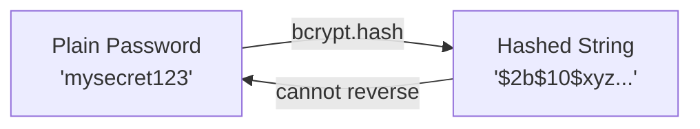
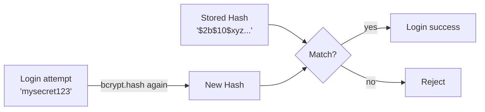
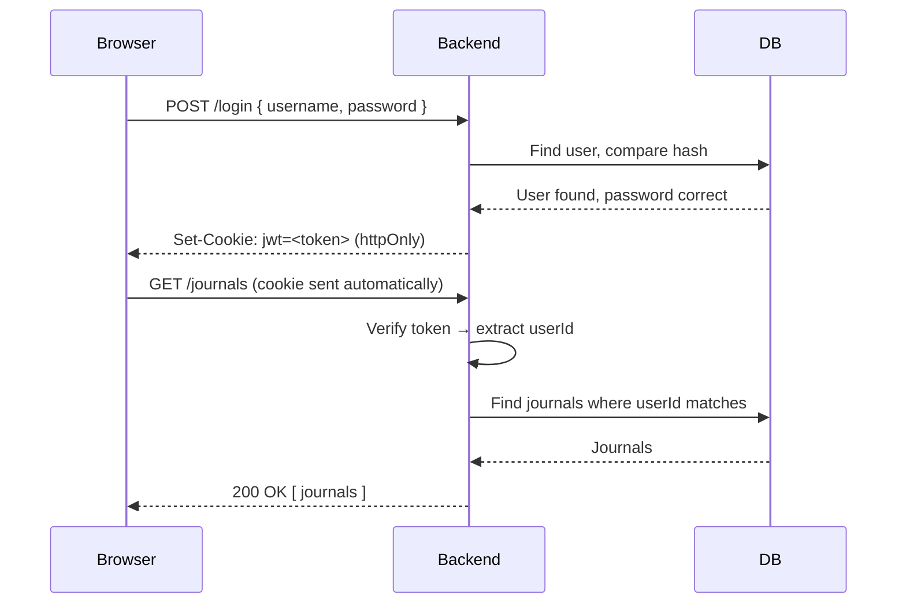
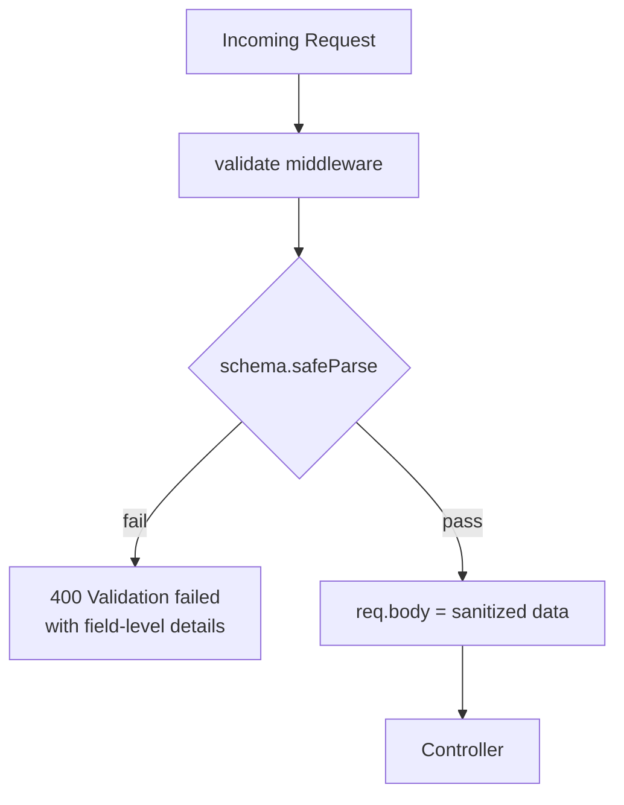
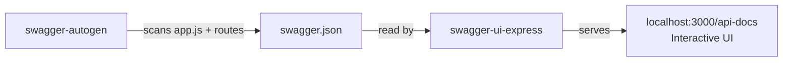
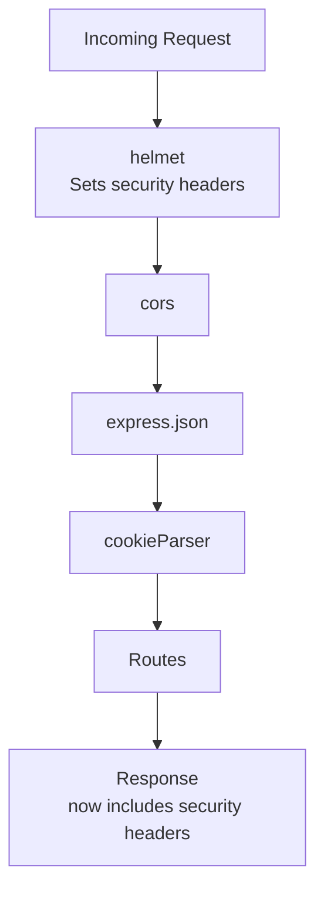
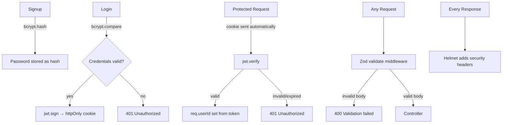

# Node.js Backend Notes - 2026-06-07

Today I focused on security and API tooling for the journal backend.
The backend moved from trusting the frontend to verifying identity itself.

Covered: password hashing, JWT authentication, input validation with Zod, interactive API docs with Swagger, and security headers with Helmet.

---

## Password Hashing with bcrypt

Before today, passwords were stored in plain text. That means if the database leaked, every user's password would be exposed immediately.

The solution is hashing. A hash is a one-way transformation:



You cannot reverse it to get the original password back.

The library used is `bcryptjs`.

During signup, the password is hashed before saving:

```js
const hashed = await bcrypt.hash(password, saltRounds)
await User.create({ username, password: hashed })
```

During login, the plain password is compared against the stored hash:

```js
const isMatch = await bcrypt.compare(password, user.password)
```

`bcrypt.compare` does not reverse the hash. It hashes the input again using the same settings and checks if the result matches.



The `saltRounds` value controls how much computation is done. Higher means more secure but slower. A value of 10 is the standard default.

---

## JWT Authentication

After verifying the password, the backend needs a way to prove identity on future requests without asking for the password every time.

JWT (JSON Web Token) solves this.



Signing a token:

```js
const token = jwt.sign({ userId: user.id }, JWT_SECRET, { expiresIn: '7d' })
```

Verifying a token:

```js
const payload = jwt.verify(token, JWT_SECRET)
req.userId = payload.userId
```

If the token is expired or tampered with, `jwt.verify` throws an error and the request is rejected.

The token is stored as an httpOnly cookie. This means JavaScript running in the browser cannot read it. It can only be sent automatically by the browser on each request.

The important security principle here:

```txt
The backend no longer trusts userId sent from the frontend.
It reads userId from the verified token only.
```

---

## Zod Input Validation

Before Zod, the backend did manual checks like:

```js
if (!username || !password) { ... }
```

This is fragile and inconsistent. Zod provides schema-based validation.

A schema describes the shape and rules of the expected input:

```js
const signupSchema = z.object({
  username: z.string().min(3).max(20).regex(/^[a-zA-Z0-9_]+$/),
  password: z.string().min(6)
})
```

A reusable middleware runs the schema against every incoming request body:



```js
const result = schema.safeParse(req.body)

if (!result.success) {
  return next(new AppError('Validation failed', 400, details))
}

req.body = result.data  // sanitized and trimmed data
```

This approach means:

```txt
Validation logic lives in one place.
Controllers receive clean, already-validated data.
Error messages are consistent and structured.
```

---

## Swagger API Documentation

The API was documented using two packages:



The generator script reads the Express app entry point and follows all route files:

```js
swaggerAutogen(outputFile, endpointsFiles, doc)
```

After running `npm run swagger`, a `swagger.json` file is created in the `swagger/` folder.

The UI is mounted in `app.js`:

```js
app.use('/api-docs', swaggerUi.serve, swaggerUi.setup(swaggerDocument))
```

Visiting `http://localhost:3000/api-docs` shows every endpoint, its expected request body, and its response. You can also test the API directly from the browser.

All swagger-related files live in one place:

```txt
swagger/
  swagger.js         ← generator config
  swagger.json       ← auto-generated output
  swagger-guide.md   ← usage notes
```

---

## Helmet Security Headers

Browsers support a set of HTTP response headers that protect against common attacks. Without them, the backend is vulnerable by default.

Helmet sets 14 of these headers automatically with one line:

```js
app.use(helmet())
```

It goes first in `app.js`, before all other middleware:



Some of the headers helmet sets:

```txt
X-Frame-Options: SAMEORIGIN       → blocks embedding in iframes
X-Content-Type-Options: nosniff   → stops browsers guessing content types
Strict-Transport-Security: ...    → forces HTTPS in production
```

No configuration is needed for a standard setup. The defaults are safe and reasonable.

---

## Main Takeaway



```txt
Before:
  - passwords stored in plain text
  - frontend sent userId and the backend trusted it
  - no validation schema
  - no security headers

After:
  - passwords are hashed with bcrypt
  - identity comes from a verified JWT, not the frontend
  - all inputs validated with Zod schemas before reaching controllers
  - API is documented and testable via Swagger UI
  - security headers set on every response via Helmet
```

The core app structure did not change. Controllers and services stayed the same. The security layer was added on top.
