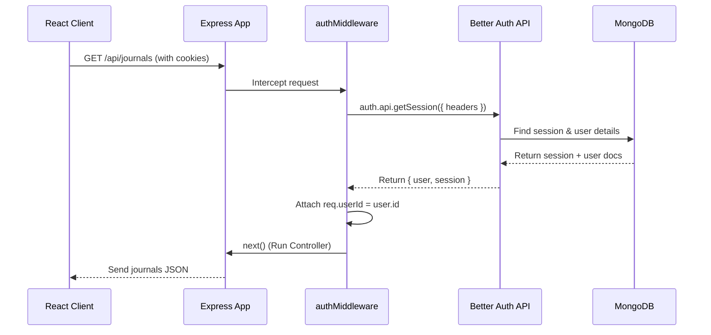

# The Great Auth Cleanup: How We Replaced Custom JWTs with Better Auth

Have you ever looked at a feature branch and felt the immediate urge to run `git rm` on hundreds of lines of code? That is exactly how it felt when we transitioned **MyJournalApp** from a custom-coded JWT auth system to **Better Auth**.

> [!TIP]
> To view how the code actually looks with Better Auth, please visit [BetterAuth_CodeSnippets.md](./BetterAuth_CodeSnippets.md).

Writing authentication from scratch is a classic developer rite of passage. You start by hashing passwords with `bcrypt`, sign a few JSON Web Tokens (JWTs), store them in cookies, write a custom verification middleware, and think: *"I've got this under control."* 

Then, you try to add Google Login. Suddenly, you're writing custom state-token validation checks, exchanging auth codes for tokens, making fetch calls to Google profile APIs, and handling anti-forgery checks. 

Here is the story of how we deleted all that boilerplate and upgraded our tech stack.

---

## The Comparison: Custom Auth vs. Better Auth

To understand why this refactor was worth it, let's look at the architectural flow change:

```mermaid
graph TD
    subgraph "Custom Session Flow (Old)"
        ClientA[React Client] -->|Manual Fetch Request| ExpressA[Express Server]
        ExpressA -->|Custom Verification Middleware| JWTMiddleware[jwt.verify / auth.js]
        JWTMiddleware -->|Verify JWT Cookie| DB1[(MongoDB)]
    end

    subgraph "Better Auth Flow (New)"
        ClientB[React Client SDK] -->|Automatic Cookie Sessions| ExpressB[Express Server]
        ExpressB -->|Better Auth Catch-all Router| BARouter[app.all '/api/auth/*splat']
        BARouter -->|Mongo Adapter| DB2[(MongoDB)]
    end
```



### Before (Without Better Auth)
* **Encryption Handling**: Manually managing bcrypt rounds and comparing credentials.
* **Token Operations**: Issuing JWT tokens, configuring cookie storage options (e.g. `httpOnly`, `secure`, `sameSite`), and manually checking headers/cookies in custom routing middleware.
* **Social OAuth Logic**: Writing ~80 lines of code just to handle state parameters, request access tokens from Google, and decode profile fields.
* **State Sync**: Polling `/me` endpoints inside React's `useEffect` and storing user records in local storage.

### After (With Better Auth)
* **Encryption Handling**: Managed securely out of the box using modern default hashing configurations.
* **Token Operations**: Better Auth handles secure cookie sessions automatically.
* **Social OAuth Logic**: Simply add the credentials as environment variables; Better Auth handles the redirects, state parameters, and exchanges behind the scenes.
* **State Sync**: A single reactive hook (`useSession()`) on the client handles caching, fetching, and session synchronization.

---

## What Better Auth Eliminated From Our Code

By moving to Better Auth, we deleted a significant amount of boilerplate code:

### 1. Manual JWT and Cookie Middleware
We deleted our custom JWT verification middleware, replacing it with a single Better Auth call. Here is the lifecycle of how the new session authentication works:



```javascript
// Before: Custom JWT checks
let token = req.cookies?.jwt;
if (token) {
  const payload = jwt.verify(token, JWT_SECRET);
  req.userId = payload.userId;
}

// After: Better Auth Session Check
const session = await auth.api.getSession({ headers: req.headers });
req.userId = session.user.id;
```

### 2. Manual OAuth Exchange Flow
We eliminated custom API fetches to exchange authorization codes:
```javascript
// Before: Exchanging code with Google APIs manually
const tokenRes = await fetch('https://oauth2.googleapis.com/token', { ... });
const googleUser = await userRes.json();
const user = await findOrCreateGoogleUser(googleUser.sub, googleUser.email);
```
Better Auth handles the entire OAuth sequence through its client and server handlers under the hood.

---

## How We Migrated (The Steps We Followed)

Here is the exact migration path we followed to transition the app:

### Step 1: Converting the Express Backend to ES Modules (ESM)
Better Auth is built for modern environments and is **ESM-only**. We updated `backend/package.json` to `"type": "module"` and refactored the entire backend from CommonJS (`require`/`module.exports`) to ES Modules (`import`/`export`).

### Step 2: Fixing the Database Startup Race Condition
Better Auth needs an active database connection to initialize. Since Mongoose connects asynchronously, we refactored `backend/server.js` to await the database connection first, using dynamic `import` to load the application:

```javascript
async function startServer() {
  await connectDb(); // 1. Wait for Mongoose to connect
  const { default: app } = await import('./app.js'); // 2. Load Express and Better Auth
  app.listen(PORT);
}
```

### Step 3: Setting Up the Better Auth Server Configuration
We created [backend/config/auth.js](file:///c:/Users/mrsan/Desktop/MyJournalApp/backend/config/auth.js) to configure the server, reusing Mongoose's active MongoDB connection:

```javascript
const client = mongoose.connection.getClient();
const db = client.db();

export const auth = betterAuth({
  database: mongodbAdapter(db, { client }),
  emailAndPassword: { enabled: true },
  plugins: [ username() ]
});
```

### Step 4: Standardizing Database Collections
Better Auth defaults to singular collection names: `user`, `session`, and `account`. We explicitly configured our Mongoose models (like `User`) to target the singular collection:
```javascript
const User = mongoose.model('User', userSchema, 'user');
```
We then dropped duplicate pluralized collections (`users`, `sessions`, `accounts`) to standardize on a clean database structure.

### Step 5: Connecting the React Client SDK
On the frontend, we installed the client SDK and created [frontend/src/services/auth-client.js](file:///c:/Users/mrsan/Desktop/MyJournalApp/frontend/src/services/auth-client.js). We then updated [AuthContext.jsx](file:///c:/Users/mrsan/Desktop/MyJournalApp/frontend/src/context/AuthContext.jsx) to wrap client SDK calls and manage the session state reactively:

```javascript
const sessionQuery = authClient.useSession();
const session = sessionQuery?.data;
```

---

## The Takeaway

Migrating to Better Auth allowed us to delete custom JWT configurations and manual Google Login integrations, replacing them with a standardized, secure configuration.

For our application, this means less code to maintain, no manual encryption configurations, and a clean path to add security additions like **Two-Factor Authentication (2FA)** or **Passkeys** with just a single configuration flag.

---

## Learn More
To explore additional configuration options, plugins, and guides, visit the official [Better Auth Documentation](https://better-auth.com/docs).
YT --> https://www.youtube.com/watch?v=2c-0_G3vpU8 ( video teaches from documentation )
