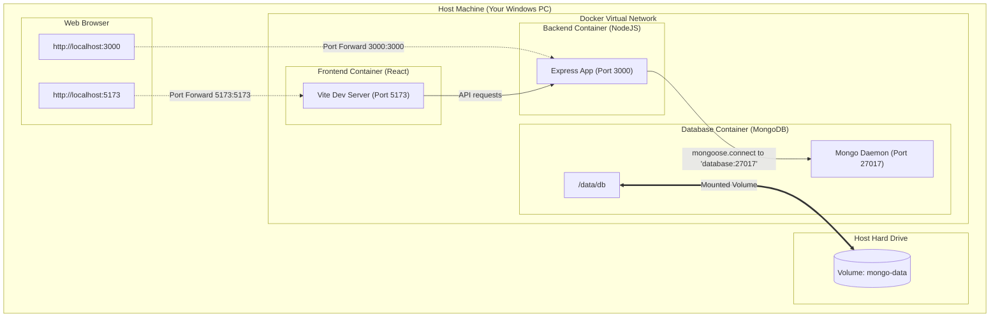

# Docker Notes

## Architecture Overview

Here is a visual map of how the components, port mappings, networks, and volumes interact inside our Docker architecture:



---

## Concept 1: The Docker Image (The Blueprint)

Think of a **Docker Image** as a complete snapshot or **blueprint** of your system. 

It contains:
1. **The Operating System:** Usually a very tiny, lightweight version of Linux (about 5MB to 50MB, not a massive 5GB OS).
2. **The Runtime:** The exact version of Node.js you want (e.g., Node v20.11.0).
3. **Your Application Files:** Your backend code, frontend code, and `package.json`.
4. **Your Installed Libraries:** The `node_modules` folder, correctly installed and compiled for that specific lightweight Linux OS.
5. **The Start Command:** An instruction telling it how to start (e.g., `npm start`).

An Image is **read-only**. Once you build it, it cannot be changed. It is like a frozen block of ice containing everything your app needs.

---

## Concept 2: The Docker Container (The Running App)

If the **Image** is a recipe, the **Container** is the actual meal you cooked using that recipe.

* You take your read-only Docker Image and tell Docker: **"Run this."**
* Docker spins up an isolated box (a **Container**) on your computer.
* Inside this box, your app runs. It thinks it is running on a dedicated Linux machine with Node.js installed, even though it's actually running on your Windows computer.
* You can spin up **multiple containers** from the exact same image.

### Why is this magical?

Because the container runs in its own isolated environment:

1. **Zero Installation:** You don't need to install Node.js on your computer to run the app. As long as you have Docker installed, Docker will run the container, which already has Node inside it.
2. **Consistency:** Whether you run this container on your Windows laptop, your colleague's Macbook, or a Linux server in the cloud, **it will behave exactly the same way**, because the OS and Node version inside the container are identical.
3. **Easy Cleanup:** If you stop and delete the container, your computer is completely clean. No leftover files, registry settings, or global npm packages cluttering your machine.

---

## Concept 3: Docker Volumes (Persistent Storage)

By default, any data written inside a running Docker container is saved to a temporary layer. If that container is stopped and deleted, **that data is deleted forever**.

For a database like MongoDB, this is a disaster! You don't want to lose all your journal entries every time you update your backend container.

### The Solution: Volumes
A **Volume** is like an external hard drive that you plug into your container. It maps a folder on your actual computer (the Host) to a folder inside the container.

* When the database container writes data to `/data/db` inside the container, Docker automatically redirects it to a folder on your actual computer (e.g., `C:\Users\...\my-db-data`).
* If you delete the container and spin up a brand new one, you simply plug the same Volume back into the new container. All your data is still there!

---

## Concept 4: Docker Networking (Communication)

Containers are completely isolated by default. A container running your Node.js backend cannot see or talk to a container running MongoDB unless we connect them.

### The Solution: Docker Networks
When we run our app, Docker creates a virtual private network. 

* We put both the `backend` container and the `database` container on the same network.
* Once they are on the same network, Docker automatically registers their **container names** as hostnames.
* So, in your backend code, instead of connecting to `localhost:27017` (which would refer to the backend container itself), you connect to:
  `mongodb://my-database-container-name:27017/myjournal`

---

## Concept 5: The Dockerfile (Building the Image)

A **Dockerfile** is a simple text file (with no file extension) containing a list of step-by-step instructions. Docker reads this file from top to bottom and builds your custom Image.

Let's look at a real-world example of what a `Dockerfile` for your **Node.js backend** looks like, and break down what each line does.

```dockerfile
# Step 1: Choose the base image (the starting point)
FROM node:20-alpine

# Step 2: Create a directory inside the container for our app code
WORKDIR /app

# Step 3: Copy package files first
COPY package*.json ./

# Step 4: Install the dependencies inside the container
RUN npm install

# Step 5: Copy the rest of our backend code into the container
COPY . .

# Step 6: Inform Docker that the app listens on port 5000
EXPOSE 5000

# Step 7: Specify the command to run when the container starts
CMD ["node", "server.js"]
```

### Detailed Breakdown of the Commands:

#### 1. `FROM node:20-alpine`
* **What it does:** Tells Docker to start building on top of an existing, official Node.js image.
* **Why `alpine`?** Alpine is a tiny, highly secure, lightweight version of Linux (under 5MB). Using it keeps our image size very small.

#### 2. `WORKDIR /app`
* **What it does:** Creates a folder called `/app` inside the container and makes it the active directory. Any subsequent commands will run inside this folder.

#### 3. `COPY package*.json ./` and `RUN npm install`
* **What it does:** Copies only the `package.json` and `package-lock.json` files from your computer into `/app`, then runs `npm install` inside the container.
* **Why do we copy package.json separate?** Docker caches each step. If your dependencies don't change, Docker skips `npm install` and uses the cache, making builds very fast.

#### 4. `COPY . .`
* **What it does:** Copies all the remaining files from your local backend directory into the container's `/app` directory.

#### 5. `EXPOSE 5000`
* **What it does:** Documents that the container will listen on port 5000 at runtime.

#### 6. `CMD ["node", "server.js"]`
* **What it does:** Defines the command that runs **only when the container is started**.
* **Note:** `RUN npm install` happens *during building*. `CMD` happens *during running*.

---

## Concept 6: docker-compose.yml (The Coordinator)

### The Problem: Managing Multiple Dockerfiles

So far, we know that:
* We can create a `Dockerfile` for our `backend` (to build a backend image).
* We can create a `Dockerfile` for our `frontend` (to build a frontend image).
* We also need to run `MongoDB` (which uses a ready-made official image from Docker Hub).

If we only used `Dockerfile`s, we would have to run several verbose commands manually in our terminal to set up the network, the volume, and run each container with the correct ports and dependencies.

### The Solution: `docker-compose.yml`

Instead of running all those separate commands, Docker has a tool called **Docker Compose**. 

You write a single YAML file called `docker-compose.yml` in the root folder of your project. This file describes **your entire multi-container app**.

Here is a simplified example of what ours will look like:

```yaml
version: '3.8'

services:
  # 1. MongoDB Database Container
  database:
    image: mongo:6.0         # Download official MongoDB image
    ports:
      - "27017:27017"        # Expose port to our host machine
    volumes:
      - mongo-data:/data/db  # Use volume to persist data

  # 2. Express Backend Container
  backend:
    build: ./backend         # Build the image using the Dockerfile inside ./backend
    ports:
      - "3000:3000"          # Map port 3000 on host to port 3000 in container
    environment:
      - DATABASE_URL=mongodb://database:27017/myjournal  # Connect using container name!
      - PORT=5000
    depends_on:
      - database             # Start the database container before the backend container

  # 3. React Frontend Container
  frontend:
    build: ./frontend        # Build the image using the Dockerfile inside ./frontend
    ports:
      - "3000:3000"          # Map port 3000 on host to port 3000 in container
    depends_on:
      - backend              # Start the backend container before the frontend container

# Define the persistent volume used by the database service
volumes:
  mongo-data:
```

### Why is this amazing?

Once this file is written, you only need to run **one command** in your terminal:

```bash
docker compose up
```

Docker Compose will automatically:
1. Build the backend and frontend images.
2. Download the MongoDB image.
3. Set up the network and the volume.
4. Start all three containers in the correct order (Database first, then Backend, then Frontend).

And when you want to stop everything, you run:
```bash
docker compose down
```

---

## Practical Value: Sharing the Project with Others

When sharing your project with a friend or colleague, Docker eliminates the common *"It works on my machine"* problem.

### Without Docker
Your friend must manually install and configure:
1. The exact same version of Node.js.
2. A local MongoDB database service.
3. Native dependencies (which might fail to compile on different operating systems like macOS or Windows).

### With Docker
Your friend only needs to clone the repository and run:
```bash
docker compose up
```
Docker handles downloading MongoDB, installing the correct Node version, compiling all packages inside a standard Linux container, and linking the database, backend, and frontend together automatically. It runs identically on any computer.
