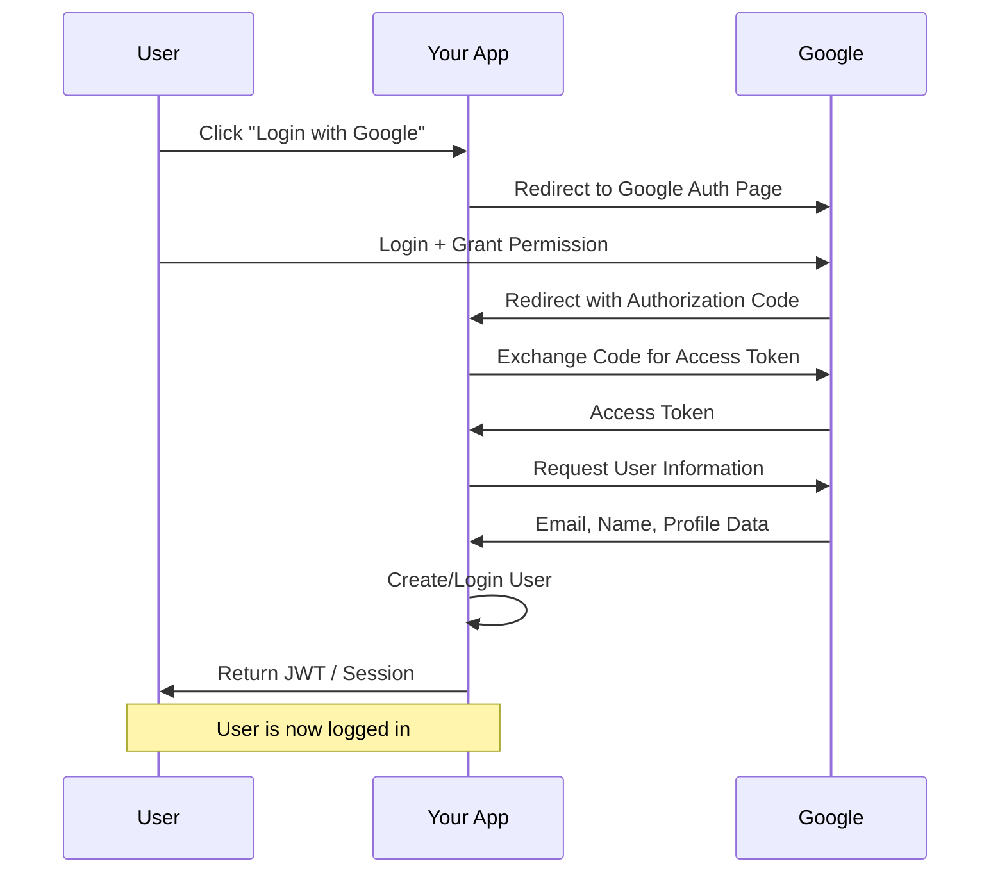

# OAuth 2.0 Flow

---

## How Google Login Works (Step-by-Step)

We can break the login flow down into 4 simple phases:

### Phase 1: Redirection & Consent
* **Step 1**: The user clicks **"Login with Google"** on the client (React).
* **Step 2**: The backend constructs Google's authentication URL and redirects the user's browser there.
* **Step 3**: The user logs in securely on Google's domain and consents to share basic profile details (email, profile picture, name).

### Phase 2: Callback & Auth Code
* **Step 4**: Google redirects the browser back to our backend callback endpoint (e.g., `/api/auth/google/callback`).
* **Step 5**: The redirect includes a short-lived **Authorization Code** in the URL query string.

### Phase 3: Token Exchange
* **Step 6**: The backend intercepts this authorization code.
* **Step 7**: The backend makes a direct server-to-server call to Google, passing the **Authorization Code**, **Client ID**, and **Client Secret**.
* **Step 8**: Google verifies these and returns an **Access Token** and an **ID Token**.

### Phase 4: Profiling & Session
* **Step 9**: The backend uses the tokens to request the user's Google profile information (email, name, picture).
* **Step 10**: Google returns the user details.
* **Step 11**: The backend checks if this user exists in MongoDB. If not, it creates a new user profile.
* **Step 12**: The backend generates its own application **JWT/Session Cookie** and redirects the user back to the React app dashboard.

The user is now fully authenticated in our system!

---

## Technical Backend Implementation Summary (Revision)

Here is a quick reference of the backend files and database logic changed to support this flow:

### 1. Database Schema
* **File**: [userModel.js](file:///c:/Users/mrsan/Desktop/MyJournalApp/backend/models/userModel.js)
* **Changes**:
  * `password`: Updated property to `required: false` (since Google logins bypass manual passwords).
  * `googleId`: Added as a unique, sparse String schema property (stores Google's unique user ID).
  * `findOrCreateGoogleUser()`: Finds the user by `googleId`. If not found, checks by email/username (to link to an existing password account if applicable), or creates a new profile.

### 2. Backend Routes & Controllers
* **Files**: [auth.js](file:///c:/Users/mrsan/Desktop/MyJournalApp/backend/routes/auth.js) & [authController.js](file:///c:/Users/mrsan/Desktop/MyJournalApp/backend/controllers/authController.js)
* **Changes**:
  * `GET /api/auth/google`: Generates a random `oauth_state` security token, saves it as an HTTP-only anti-forgery cookie, and redirects user to Google's consent screen.
  * `GET /api/auth/google/callback`: Clears the state cookie, validates the callback `state` token, exchanges the `code` for an access token via native Node `fetch`, fetches the user's profile info, calls the DB creator service, sets the local session `jwt` cookie, and redirects the browser back to React `/journals`.
  * `GET /api/auth/me`: Decodes the `jwt` cookie using the authorization middleware and returns the logged-in user profile.
