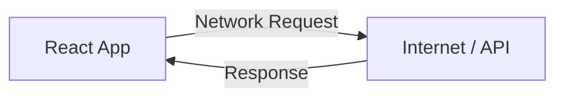
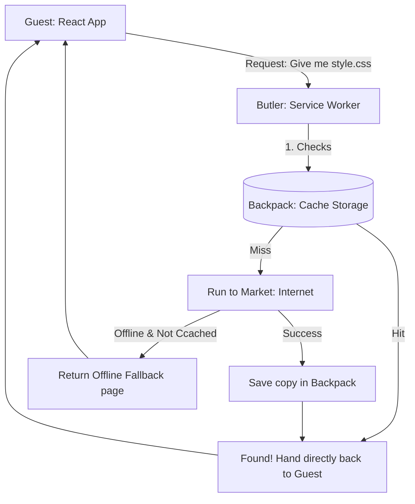
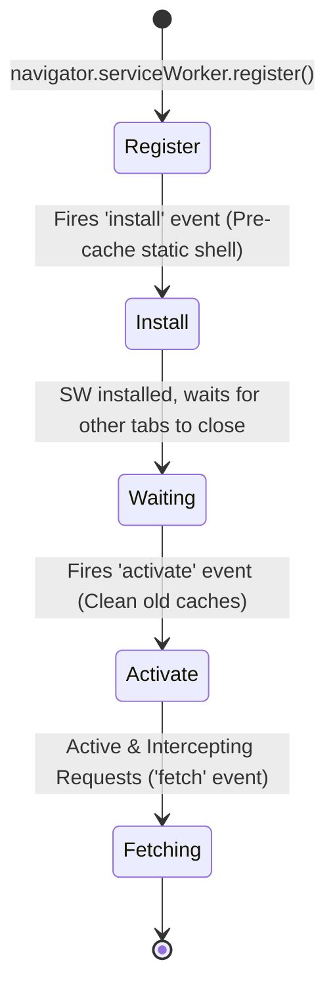
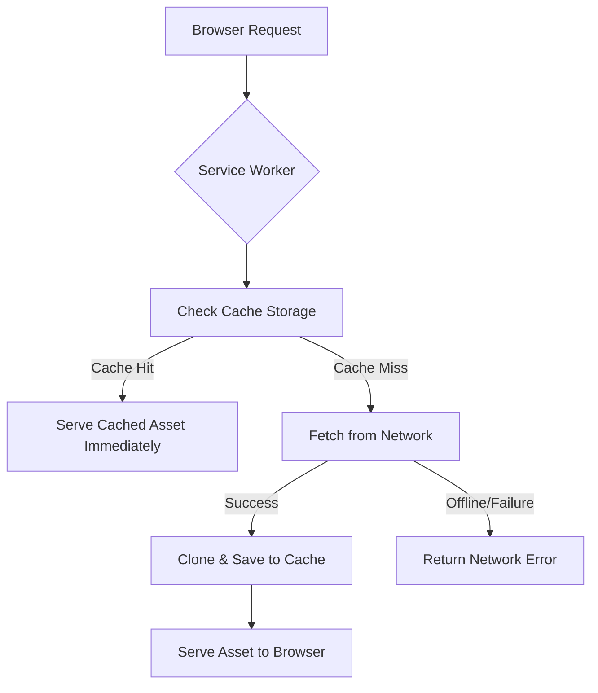
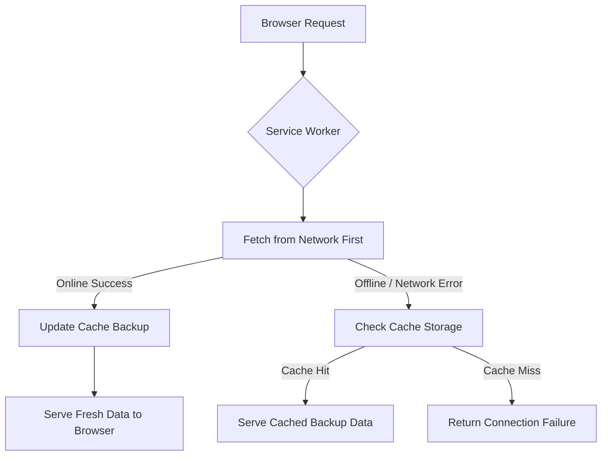
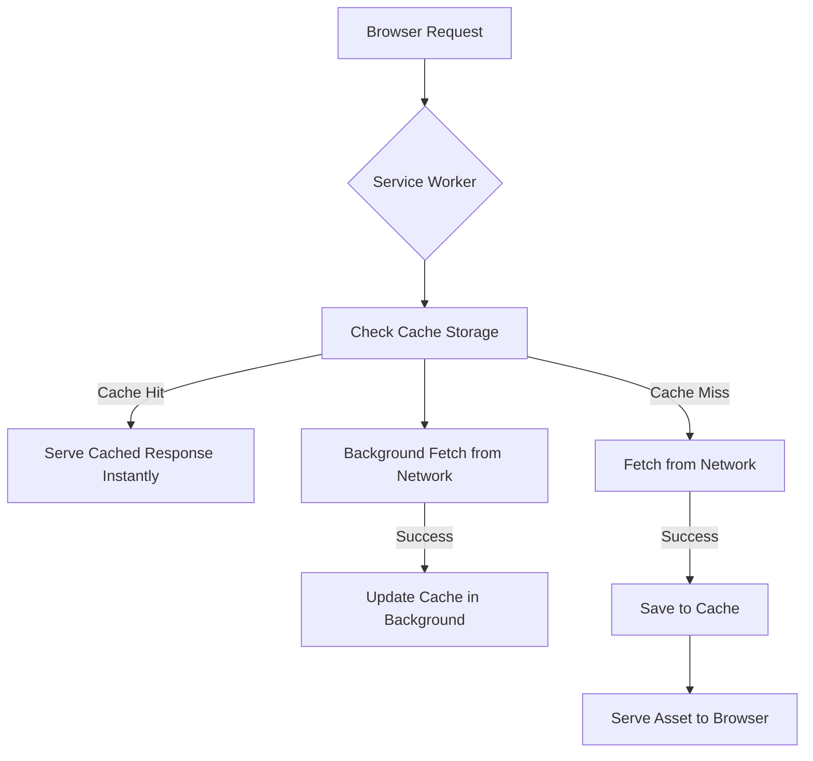
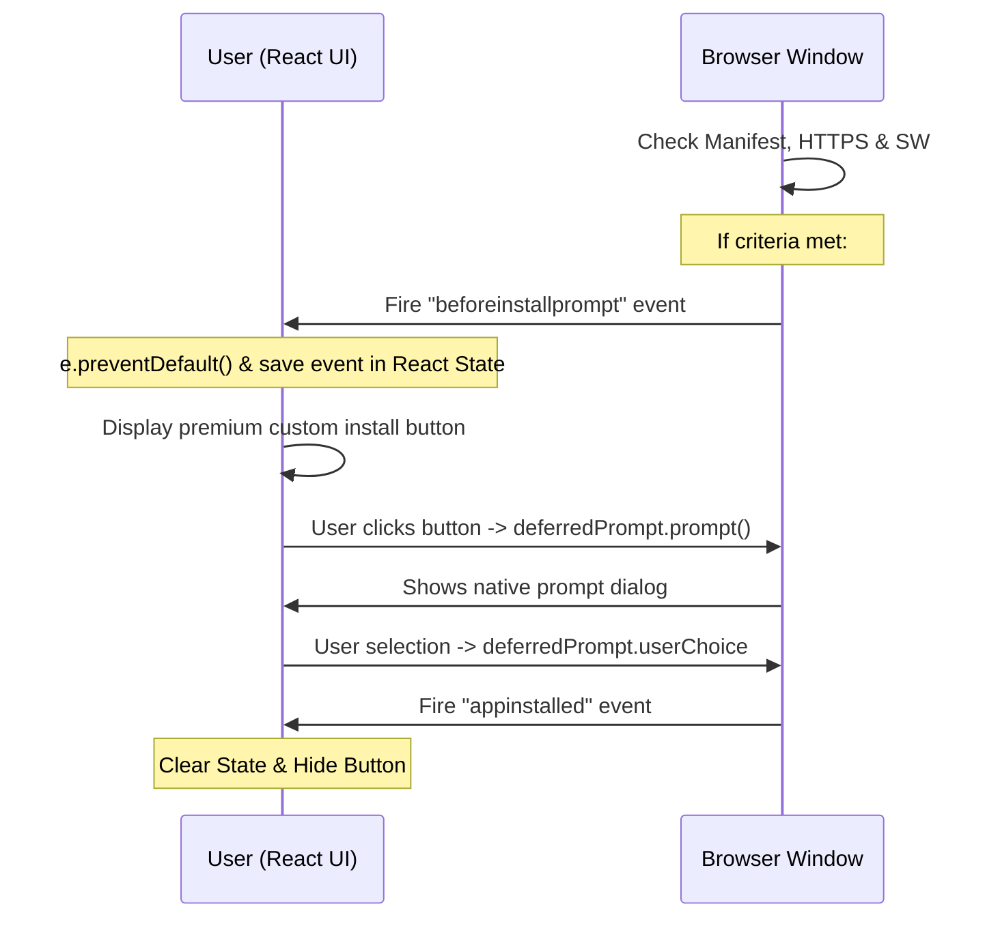
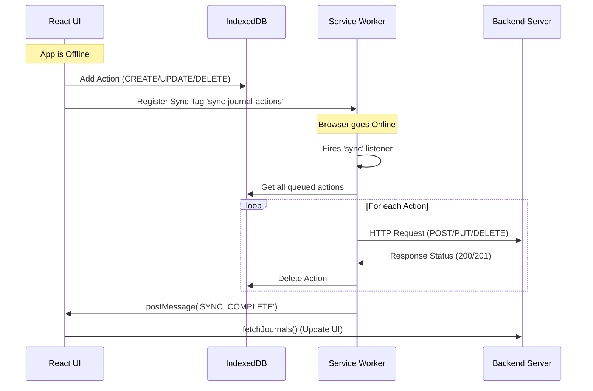

# PWA and Service Worker Basics - 2026-06-09

Today I focused on Progressive Web Apps (PWAs) — understanding how they differ from native apps, configuring the Web App Manifest with Richer Install UI assets, and learning the Service Worker lifecycle using a butler analogy.

Covered: PWA fundamentals, `manifest.json` configurations, icon sizing requirements, screenshots, and the Service Worker lifecycle stages.

---

## 1. PWA Fundamentals

A **Progressive Web App (PWA)** is a website built with web technologies that behaves like a native application. 

### PWA vs. Native Apps

| Feature | Native App | PWA |
| :--- | :--- | :--- |
| **Distribution** | App Stores (Google Play / App Store) | Web URL / Browser prompt |
| **Install Size** | Large (typically 50MB+) | Small (typically < 1MB) |
| **Updates** | App Store update triggers | Auto-updates when page refreshes |
| **Offline Support** | Built-in | Programmed via Service Worker |
| **Core Dev Stack** | Swift, Kotlin, Java, React Native | HTML, CSS, JavaScript |

---

## 2. Web App Manifest (`manifest.json`)

The Web App Manifest is a JSON file that provides the browser with metadata about how your application should behave when installed on a device.

Key fields configured today:
* `name` & `short_name`: The full name and the name displayed under the home screen icon.
* `display`: Set to `standalone` to remove the browser UI and address bar.
* `theme_color`: Sets the styling of the OS system bar when the app is active.
* `background_color`: Styling for the splash screen when launching.
* `icons`: Requires exactly `192x192` and `512x512` images.
* `screenshots`: Essential for Chrome's **Richer Install UI**. Needs at least:
  * One wide screenshot (e.g., `1280x720` with `form_factor: "wide"`)
  * One narrow screenshot (e.g., `390x844` with `form_factor: "narrow"` or not set)

---

## 3. The Service Worker: "The Butler" Analogy

A Service Worker is a client-side programmable network proxy. It acts as an intermediary layer between your React app and the network.

### Traditional Request Model (No Butler)

Without a Service Worker, your app has to talk directly to the network. If the connection fails, the user gets a "No Internet" screen.



### PWA Request Model (The Butler at the Door)

A Service Worker acts like a **Butler** standing by the room door. The **Guest** (React App) asks the Butler for items, and the Butler decides how to retrieve them.



Because the Service Worker runs in a separate thread, it operates in the background even if the React page itself is closed.

---

## 4. Service Worker Lifecycle

A Service Worker goes through a strict multi-stage lifecycle to ensure updates do not break active sessions.



### 1. Registration (Hiring the Butler)
Initiated in the main application code (e.g. `src/main.jsx`). The browser downloads and evaluates the script.
```js
if ('serviceWorker' in navigator) {
  navigator.serviceWorker.register('/sw.js')
    .then(reg => console.log('Service Worker Registered!', reg))
    .catch(err => console.error('Registration failed:', err));
}
```

### 2. Installation (Pre-packing the Backpack)
Fires once when the worker is downloaded for the first time or when it changes. This is the optimal place to open the Cache and store resources.
```js
self.addEventListener('install', (event) => {
  console.log('SW Installed');
  // pre-caching code goes here
});
```

### 3. Activation (Dismissing the Old Butler)
Fires when the service worker is activated and ready to assume control. If an older service worker is running, the new one waits in the background until all tabs running the old version are closed.
```js
self.addEventListener('activate', (event) => {
  console.log('SW Activated');
  // old cache cleanup code goes here
});
```

### 4. Fetch (Running errands)
Once active, every HTTP request the app initiates passes through this listener. The Service Worker can intercept, modify, cache, or bypass the request.
```js
self.addEventListener('fetch', (event) => {
  console.log('Intercepted request for:', event.request.url);
  // caching/routing strategy goes here
});
```

---

## 5. Asset Caching & Cache-First Strategy

To populate the Butler's backpack (cache) and enable offline capabilities, we implemented three key steps in `sw.js` today:

### A. Pre-caching on Install
An array of static path URLs is defined. The `install` event uses `caches.open` and `cache.addAll` to pre-download the app shell.
```js
const CACHE_NAME = 'journal-cache-v5'
const ASSETS_TO_CACHE = [
  '/',
  '/index.html',
  '/offline.html', // Pre-cached for fallback
  '/manifest.json',
  '/favicon.svg',
  '/icons/icon-192.png',
  '/icons/icon-512.png',
  '/screenshots/screenshot-desktop.png',
  '/screenshots/screenshot-mobile.png'
]

self.addEventListener('install', (event) => {
  event.waitUntil(
    caches.open(CACHE_NAME).then((cache) => {
      return cache.addAll(ASSETS_TO_CACHE)
    })
  )
})
```

### B. Old Cache Cleanup on Activate
When a new Service Worker activates, it reads all existing Cache keys. If any keys do not match the current `CACHE_NAME` (e.g. `journal-cache-v1` vs an old `journal-cache-v0`), it deletes them.
```js
self.addEventListener('activate', (event) => {
  event.waitUntil(
    caches.keys().then((cacheNames) => {
      return Promise.all(
        cacheNames.map((cache) => {
          if (cache !== CACHE_NAME) {
            return caches.delete(cache)
          }
        })
      )
    })
  )
})
```

### C. Cache-First Fetch with Restricted Dynamic Caching
To test and run the app offline without cache bloat (which occurs if we dynamically cache every dev hot-reload module), we use a production-ready approach:
1. We check the Cache first.
2. If not found, we fetch from the network.
3. If the network call is a successful `GET` request and belongs to the production assets bundle (inside `/assets/`), we dynamically clone and cache it.
```js
self.addEventListener('fetch', (event) => {
  if (event.request.method !== 'GET') return
  if (!event.request.url.startsWith(self.location.origin)) return

  event.respondWith(
    caches.match(event.request).then((cachedResponse) => {
      if (cachedResponse) return cachedResponse

      return fetch(event.request).then((networkResponse) => {
        const isAsset = event.request.url.includes('/assets/')

        if (networkResponse && networkResponse.status === 200 && isAsset) {
          const responseToCache = networkResponse.clone()
          caches.open(CACHE_NAME).then((cache) => {
            cache.put(event.request, responseToCache)
          })
        }
        return networkResponse
      })
    })
  )
})
```

### D. Updating Cached Assets (Cache Invalidation)
Because static assets are stored via a **Cache-First** strategy, the browser will not query the network for them unless the cache changes.

To update files (e.g. you edited a JS component, changed CSS, or replaced an icon):
1. **Change the cache version string in `sw.js`:**
   ```javascript
   const CACHE_NAME = 'journal-cache-v6' // Incremented from v5
   ```
2. **Evaluation:** The browser downloads `sw.js`, sees that the file has changed (due to the version change), and downloads it.
3. **Installation:** The new Service Worker installs, creates the new cache namespace (`v6`), and pre-caches the updated assets.
4. **Activation:** Once all old tabs running the app are closed, the new worker activates. Its `activate` handler loops through the browser caches and deletes the obsolete `v5` cache, ensuring the client receives the fresh `v6` files upon next launch.

### E. Offline Fallback Page
If the user navigates to a new page or reloads a non-cached document while offline, the network request fails. We intercept this in the `.catch()` block and return our pre-cached `offline.html` page:
```javascript
return fetch(event.request).then((networkResponse) => {
  // ...
  return networkResponse
}).catch(() => {
  // Check if it's a document request (user navigating/refreshing)
  if (event.request.headers.get('accept') && event.request.headers.get('accept').includes('text/html')) {
    return caches.match('/offline.html')
  }
})
```

---

## 6. PWA Caching Strategies

To handle asset loading under different network scenarios, we use three primary caching strategies. Each strategy defines a unique path that network requests take:

---

### A. Cache First (Cache falling back to Network)

#### Step-by-Step Logic:
1. **Intercept request:** The service worker catches the request.
2. **Check Cache:** It looks inside local Cache Storage for the matching key.
3. **If Cached (Hit):** It returns the saved response immediately. **The network is never contacted.**
4. **If Not Cached (Miss):** It goes to the network to fetch the resource.
5. **Update and Return:** Once the network returns the file, a clone is saved in the cache, and the response is sent to the browser.



* **How it works:** Look in the cache first. If found, return it immediately. If not found, download it from the network, save a copy in the cache for next time, and return it.
* **When to use:** Static assets that rarely change (compiled CSS, JS bundles, images, local fonts, icons).
* **Pros:** Extremely fast (near 0ms loading time) and saves significant network bandwidth.
* **Cons:** If you update the file on the server, the browser will continue to serve the cached old version until the service worker's cache version is manually incremented.

---

### B. Network First (Network falling back to Cache)

#### Step-by-Step Logic:
1. **Intercept request:** The service worker catches the request.
2. **Hit Network:** It immediately attempts to fetch the latest version from the network.
3. **If Network Succeeds:** It duplicates the response, updates the cache storage with the fresh data, and returns the response.
4. **If Network Fails (Offline/Timeout):** It falls back and checks Cache Storage.
5. **Serve Cache:** If the cached backup is found, it returns the cached data. If there is no cached backup, the request fails.



* **How it works:** Try fetching from the internet first. If successful, save a copy in the cache and return the fresh data. If the network call fails (offline/server down), read the cached version instead.
* **When to use:** Dynamic data that changes frequently (API responses, user profile details, database logs, list of journal entries).
* **Pros:** The user always sees the most up-to-date data when online.
* **Cons:** Slowest offline strategy (it has to wait for the network to timeout/fail before displaying the cached copy).

---

### C. Stale-While-Revalidate

#### Step-by-Step Logic:
1. **Intercept request:** The service worker catches the request.
2. **Serve Cache Immediately:** It checks the cache. If found, it immediately serves the cached copy so the screen loads instantly.
3. **Trigger Background Fetch:** Simultaneously, it fires a silent fetch request to the network in the background.
4. **Revalidate Cache:** When the network response returns, the service worker saves the new data into the cache (updating the "stale" cache for the *next* reload).



* **How it works:** Serve the cached version immediately (instant load). At the exact same time in the background, send a silent request to the network to get the latest version. When the network responds, overwrite the cache.
* **When to use:** User avatars, dashboard stats, news feeds, settings pages where the content needs to load instantly but showing slightly older data is temporarily acceptable.
* **Pros:** Ultra-fast loading speed while keeping the cache automatically updated in the background.
* **Cons:** The user sees outdated data on their first page load, and it uses network data in the background on every request.

---

## Main Takeaway

* A PWA is built on two core components: `manifest.json` (metadata for installation/UI appearance) and a Service Worker (a background thread proxy handling network requests and caching).
* Icons must be strictly sized (`192x192` and `512x512`). 
* Chrome's Richer Install UI requires both wide and narrow screenshots.
* The Service Worker is independent of the DOM and cannot directly access `window` or `document`.
* Cache storage acts as a local database for HTTP responses, allowing the app to run completely offline once the static asset shell is cached.
* **Cache-First** strategy is ideal for static assets (HTML, CSS, JS, images) because they change infrequently and speed is prioritized.
* **Cache Invalidation:** To deploy front-end updates when using a Cache-First strategy, you must manually increment the version string in `CACHE_NAME` inside `sw.js`.
* **Offline Fallback:** Catching failed fetch requests for HTML documents lets us display a styled `offline.html` screen, guaranteeing a premium offline brand experience instead of the browser's raw error.
* **Network-First:** Necessary for APIs (like our journal lists) so users see fresh entries online, while providing a graceful cached fallback when offline.

---

## 7. App Installation Experience (18.7)

Instead of relying on the browser's automatic and inconsistent install banners, we can build custom, premium install buttons and banners directly in our React UI.

### The beforeinstallprompt Hook Workflow

The browser triggers the `beforeinstallprompt` window event when the app satisfies all PWA installation requirements.



### Core Code Snippets

#### 1. Listening and Intercepting (in Context/State)
We prevent the default prompt and save it to state so we can trigger it when the user clicks our custom UI button.
```javascript
window.addEventListener('beforeinstallprompt', (e) => {
  e.preventDefault() // Stop default mini-infobar
  setDeferredPrompt(e) // Store event
  setIsInstallable(true) // Show custom install UI
})
```

#### 2. Triggering the Install Dialog
When the user clicks the custom install button, we prompt them and await their decision.
```javascript
const install = async () => {
  if (!deferredPrompt) return
  deferredPrompt.prompt() // Show browser dialog
  const { outcome } = await deferredPrompt.userChoice
  setDeferredPrompt(null)
  setIsInstallable(false)
  return outcome === 'accepted'
}
```

#### 3. Detecting Standalone Mode
To hide installation elements if the app is already installed and opened as a standalone window:
```javascript
const isInstalled = window.matchMedia('(display-mode: standalone)').matches
```

---

## 8. PWA Auditing & Lighthouse (18.8)

Lighthouse is an open-source, automated tool for improving the quality of web pages. It provides audits for **Performance, Accessibility, Best Practices, SEO, and PWA**.

### Core PWA Audit Requirements
For Lighthouse to pass the PWA installability audit, the page must:
1. **Be served over HTTPS** (or localhost).
2. **Have a valid Manifest** containing `name`/`short_name`, `icons` (192px and 512px), `start_url`, and a display mode of `standalone`, `minimal-ui`, or `fullscreen`.
3. **Register a Service Worker** with a `fetch` listener.
4. **Be responsive** (mobile-friendly layout).

---

## 9. Push Notifications in Depth (18.9)

Push notifications are sent from your server to the browser, allowing you to re-engage users even if the app tab or browser is closed.

### The 2 Sets of Cryptographic Keys
* **VAPID Keys (Server Identity):** Proves to Google/Mozilla's Push Service who sent the message. Stored as a Public/Private keypair.
* **Subscription Keys (Message Encryption):** Generated by the browser (`p256dh` and `auth`). Encrypts the payload end-to-end so Google/Mozilla cannot read it.

```mermaid
flowchart TD
    subgraph Backend Server
        Vapid[Sign headers with VAPID Private Key]
        Encrypt[Encrypt payload with Browser p256dh Key]
    end
    
    subgraph Push Service
        Google[Google / Mozilla Servers]
        Verify[Verify VAPID Public Key Signature]
    end
    
    Backend Server -->|POST with VAPID JWT Header & Encrypted Blob| Google
    Google --> Verify
    Verify -->|Matches? Forward Encrypted Blob| Device[Client Browser / Device]
    Device -->|Decrypts using local Private Key| SW[Service Worker displays notification]
```

### The Step-by-Step Notification Flow

#### Phase 1: Requesting Permission (Client-Side)
We ask the user for permission. The browser displays a native permissions dialog.
```javascript
const result = await Notification.requestPermission()
// result is 'granted', 'denied', or 'default'
```

#### Phase 2: Generating the Subscription (Client-Side)
If granted, we fetch the server's public VAPID key, and subscribe through the browser's Service Worker `PushManager`.
```javascript
const registration = await navigator.serviceWorker.ready
const subscription = await registration.pushManager.subscribe({
  userVisibleOnly: true, // Required for privacy rules
  applicationServerKey: urlBase64ToUint8Array(VAPID_PUBLIC_KEY)
})
```
*The result is a subscription object containing the unique endpoint URL and client cryptographic keys (`p256dh`, `auth`).*

#### Phase 3: Storing Subscription on Backend (Server-Side)
The frontend sends the subscription object via `POST` to the backend. The backend updates or inserts the subscription in MongoDB, associated with the user's `userId`.
```javascript
await PushSubscription.findOneAndUpdate(
  { userId, endpoint },
  { keys },
  { upsert: true }
)
```

#### Phase 4: Sending the Push (Server-Side)
When triggering a notification, the server retrieves active subscriptions, encrypts the payload, signs the VAPID headers, and sends it to the vendor endpoint.
```javascript
const payload = JSON.stringify({ title: 'Reminder', body: 'Time to write!' })
await webpush.sendNotification(subscription, payload)
```
*Note: If the Push Service returns status `410` (Gone) or `404` (Not Found), the backend immediately deletes the expired subscription from MongoDB.*

#### Phase 5: Receiving the Push (Client-Side SW)
The browser receives the push message, wakes up the Service Worker in the background, fires a `push` event, decrypts the message, and displays the banner.
```javascript
self.addEventListener('push', (event) => {
  const data = event.data.json()
  event.waitUntil(
    self.registration.showNotification(data.title, {
      body: data.body,
      data: { url: data.url }
    })
  )
})
```

#### Phase 6: Clicking the Notification (Client-Side SW)
When the user clicks the notification, the Service Worker intercepts the action, closes the card, and searches for an open window tab of the app to focus, or opens a new tab.
```javascript
self.addEventListener('notificationclick', (event) => {
  event.notification.close()
  const targetUrl = event.notification.data.url
  event.waitUntil(
    clients.matchAll({ type: 'window', includeUncontrolled: true })
      .then((clientList) => {
        for (const client of clientList) {
          if (client.url.includes(self.location.origin)) {
            client.focus()
            return client.navigate(targetUrl)
          }
        }
        return clients.openWindow(targetUrl)
      })
  )
})
```

> [!WARNING]
> ### ❓ Push Notification Doubts & Solutions
>
> #### Q1: Where does the VAPID JWT (`WebPush` token) actually go? Does the browser receive it?
> **A:** **No, the browser never sees it.**
> The VAPID JWT is strictly sent in the HTTP request headers (`Authorization: WebPush <token>`) from **your backend server directly to Google/Mozilla's Push Service**. Google/Mozilla verifies the signature, discards the JWT, and forwards only the encrypted notification payload to the device.
>
> #### Q2: How does the server detect if the user uninstalled the app or blocked notifications?
> **A:** **During the next notification delivery attempt.**
> We cannot detect it at the exact moment of uninstallation because the device does not contact our server. Instead, when the server tries to dispatch a push message using `webpush.sendNotification()`, Google/Mozilla's Push Service returns an HTTP status code **`410 Gone`** or **`404 Not Found`**. The backend catches this error and deletes the obsolete subscription from MongoDB.
>
> #### Q3: How does the flow work when a user logs in and enables notifications on a second phone?
> **A:** **MongoDB stores multiple subscription entries per user.**
> 1. The browser on the new phone registers a new mailbox with Google, returning a new, unique `endpoint` URL.
> 2. The phone sends it to the backend (`POST /api/push/subscribe`).
> 3. The backend does an **upsert** (`findOneAndUpdate` with `upsert: true`). Since the new phone's endpoint doesn't exist yet, it adds a **second** document to MongoDB for the same `userId`.
> 4. When a notification triggers, `PushSubscription.find({ userId })` fetches both the PC and Phone subscription documents, and the backend dispatches to both devices.
>
> #### Q4: Does the backend send notifications directly to the browser or the OS? How does the browser wake up?
> **A:** **The backend sends the message to the Cloud Push Service, which routes it to the device OS. The OS then wakes up the browser to run the Service Worker.**
> 
> ```mermaid
> flowchart TD
>     Backend[Backend Server: webpush.sendNotification] -->|1. HTTP POST| Cloud[Cloud Push Service: e.g., Google FCM]
>     Cloud -->|2. Background Sync Channel| OS[Device OS: e.g., Google Play Services / APNs]
>     OS -->|3. Wake-up call| Browser[Browser: e.g., Chrome / Safari]
>     Browser -->|4. Fire push event| SW[Service Worker: sw.js]
>     SW -->|5. Native Banner| Screen[User UI Screen]
> ```
> 
> **Why this path is used:**
> * **Closed Browser:** If Chrome is fully closed, your backend cannot contact it. The OS-level push daemon is always running 24/7 in the background.
> * **Power Optimization:** Keeping individual connection channels open to 100 different websites would drain a mobile battery. Instead, the OS maintains a single connection to the Google/Apple messaging gateway to handle notifications for all apps.


---

## 10. Scheduled Daily Reminders & Cron Jobs

When implementing PWA notifications, we cannot run timers in the client-side Service Worker because the browser shuts it down to save battery. Therefore, daily scheduling must be handled on the backend.

### Cron Jobs in Node.js

 we use `node-cron` to schedule tasks on the server using standard cron syntax:
`* * * * *` (Minute, Hour, Day of Month, Month, Day of Week).

### Timezone-Aware Scheduling Flow

To ensure that the user receives their reminder at their custom local time (e.g. 9:30 PM local time), we:
1. **Detect Timezone:** The React frontend automatically fetches the device's IANA timezone name:
   ```javascript
   const tz = Intl.DateTimeFormat().resolvedOptions().timeZone || 'UTC'
   ```
2. **Store Preferences:** This timezone and the chosen `reminderTime` (e.g. `"21:30"`) are sent to the backend and saved in the `User` MongoDB model.
3. **Scan Every Minute:** The server runs a background cron job that executes at the start of every minute.
4. **Compare Time:** For every active user, the server formats the current UTC clock time into the user's specific local timezone and compares it to their preference:
   ```javascript
   const formatter = new Intl.DateTimeFormat('en-US', {
     timeZone: user.timezone || 'UTC',
     hour: '2-digit',
     minute: '2-digit',
     hour12: false
   })
   const parts = formatter.formatToParts(new Date())
   const hour = parts.find(p => p.type === 'hour').value
   const minute = parts.find(p => p.type === 'minute').value
   const userLocalTime = `${hour}:${minute}` // Matches "HH:MM"
   ```
5. **Send Notification:** If the times match, the server fetches the user's push subscriptions and dispatches the notification.

---

## 11. Offline Writes & Background Sync (18.10)

To make a Progressive Web App truly useful offline, users must be able to perform write operations (create, update, and delete entries) without internet connectivity. These actions are queued locally and automatically replayed to the server when connection returns.

### IndexedDB vs. LocalStorage

For rich offline applications, we use **IndexedDB** instead of `localStorage` because it is transactional, asynchronous (doesn't block the UI thread), handles large amounts of data, and supports structured objects natively without serialization.

### The Offline Action Queue Pattern

Instead of saving the raw data objects, we store **Actions** in IndexedDB. This tells the Service Worker exactly what HTTP calls to make when the device returns online:
* **`CREATE`**: Send `POST /api/journals` with the new entry payload.
* **`UPDATE`**: Send `PUT /api/journals/:id` with changes.
* **`DELETE`**: Send `DELETE /api/journals/:id`.

### Synchronization Workflow



### Temporary ID Resolution
If a user writes a new journal entry offline and edits it before reconnecting:
1. The entry receives a local temporary ID (e.g. `temp-17183000`).
2. The queue contains: `CREATE temp-17183000` and `UPDATE temp-17183000`.
3. When online, the SW replays `CREATE temp-17183000`. The server creates it and returns MongoDB ID `65c8...`.
4. The SW maps `temp-17183000` $\rightarrow$ `65c8...`, updates any subsequent actions in the queue referencing the temp ID, and correctly calls `PUT /api/journals/65c8...`.

> [!CAUTION]
> ### ❓ Why Offline Features Must Be Tested on Port 4173 (Vite Preview)
> 
> **Why you cannot test offline features on port 5173 (`npm run dev`):**
> Vite dev mode does not bundle your code. It loads hundreds of separate, unbundled ES modules from `/src/*` and `/node_modules/*` on the fly. Because these dev-only modules are not cached locally, the browser **cannot fetch them when offline**, resulting in a blank white screen where React fails to mount.
> 
> **Why you must test offline features on port 4173 (`npm run preview`):**
> Running `npm run build` compiles your entire application into a single, bundled JavaScript file inside `/dist/assets/`. When you visit the app once while online on port `4173`, the Service Worker intercepts and caches this production bundle. When you go offline, the Service Worker successfully loads this cached bundle, enabling the application to boot and route offline.

### 11.1 Component Roles & Architecture

Three files coordinate to manage the offline pipeline:
1. **[db.js](file:///c:/Users/mrsan/Desktop/MyJournalApp/src/utils/db.js)**: Wrapper around IndexedDB to initialize the database (`journal-offline-db`), write actions to `offline-actions`, read all pending actions, and delete them on success.
2. **[journalService.js](file:///c:/Users/mrsan/Desktop/MyJournalApp/src/services/journalService.js)**: The frontend API layer that intercepts offline operations (`createJournal`, `updateJournal`, `deleteJournal`), registers Background Sync tags, and returns optimistic mock objects for instant UI updates.
3. **[sw.js](file:///c:/Users/mrsan/Desktop/MyJournalApp/public/sw.js)**: Serves cached GET items when offline, listens to the browser `sync` event, runs the replay fetch requests sequentially, resolves temporary IDs to real MongoDB IDs, and broadcasts UI refresh signals.

---

### 11.2 Step-by-Step Code Execution Flow

When a write request is triggered offline (e.g., creating a journal entry):

1. **Frontend Interception**: In [journalService.js](file:///c:/Users/mrsan/Desktop/MyJournalApp/src/services/journalService.js), the `fetch()` call fails or `navigator.onLine` returns `false`. The `runOfflineFallback()` executes.
2. **Mocking the Request**:
   * Generates a temporary ID (e.g., `temp-1718534800000`).
   * Saves a JSON action descriptor (e.g., `{ action: 'CREATE', entryId: 'temp-...', payload: { title } }`) to IndexedDB.
   * Registers a sync tag with the browser:
     ```javascript
     const registration = await navigator.serviceWorker.ready;
     await registration.sync.register('sync-journal-actions');
     ```
3. **Optimistic Rendering**: The API client immediately returns the mocked entry to React so the UI updates instantly without any loading spinner.
4. **Background Replay**: Once the browser reconnects, the Background Sync manager triggers the `sync` listener inside [sw.js](file:///c:/Users/mrsan/Desktop/MyJournalApp/public/sw.js). 
   * The SW reads all actions sequentially.
   * For `CREATE`, it fires the `POST` query. The server returns the final database ID.
   * The SW maintains a map of `tempId -> realId` to rewrite any subsequent `UPDATE`/`DELETE` calls before sending them.
   * Successfully executed actions are removed from IndexedDB one-by-one.
5. **Seamless Refresh**: The SW broadcasts a message (`SYNC_COMPLETE`) to all browser tabs. The React frontend listens for this message and triggers a background fetch to sync the UI state with the server database.

---

### 11.3 Cache Storage API vs. In-Memory Merging

It is critical to distinguish between these two caching systems when offline:

* **Resource/Response Cache (Cache Storage API)**: Stores raw HTTP GET responses. When offline, this cache is **read-only** (fetch fails, so the Service Worker cannot overwrite cached data).
* **In-Memory UI State (React/Service Layer)**: Because the Cache Storage API cannot update offline, [journalService.js](file:///c:/Users/mrsan/Desktop/MyJournalApp/src/services/journalService.js) handles this dynamically. Whenever `fetchJournals()` runs offline, it fetches the stale entries served from the Service Worker cache and **applies the local IndexedDB pending actions on top of them in-memory** before passing the final merged array to React.


