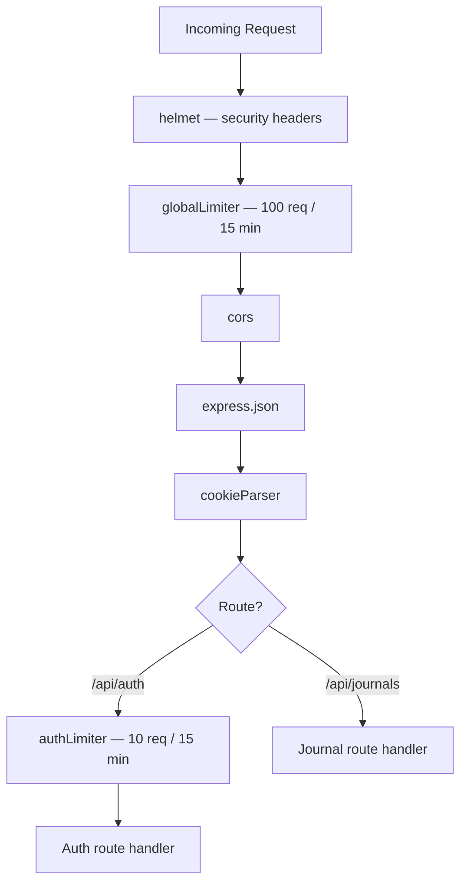
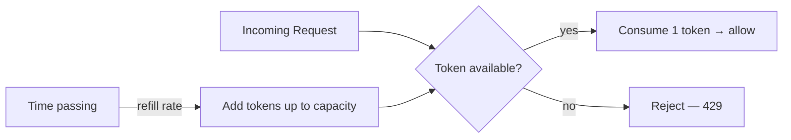
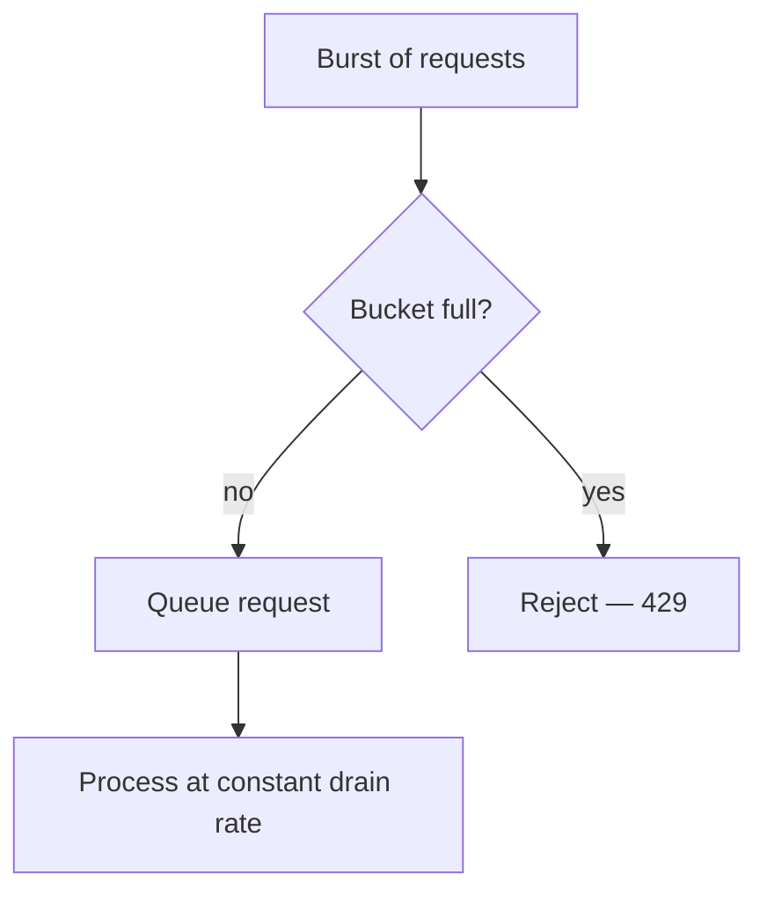

# Node.js Backend Notes - 2026-06-08

Today I focused on rate limiting — understanding what it protects against, how it works internally, and what to consider for production.

Covered: global vs auth limiters, middleware order, IP tracking, the proxy problem, in-memory vs Redis stores, and advanced options.

---

## Rate Limiting

### Why it is necessary

Without rate limiting, an attacker can send unlimited login attempts:

```txt
POST /api/auth/login  × 10,000 requests
→ brute force passwords
→ or crash the server (DoS)
```

Rate limiting caps requests per IP per time window.

### Implementation

Two limiters are used — one global, one strict for auth:

```js
// Global — all routes: 100 requests per 15 minutes per IP
const globalLimiter = rateLimit({
  windowMs: 15 * 60 * 1000,
  max: 100,
  standardHeaders: true,
  legacyHeaders: false,
  message: { error: 'Too many requests, please try again later.' }
})

// Auth — login/signup only: 10 attempts per 15 minutes per IP
const authLimiter = rateLimit({
  windowMs: 15 * 60 * 1000,
  max: 10,
  standardHeaders: true,
  legacyHeaders: false,
  message: { error: 'Too many login attempts, please try again in 15 minutes.' }
})
```

Middleware order in `app.js`:



`standardHeaders: true` sends these headers back to the client:

```txt
RateLimit-Limit: 10
RateLimit-Remaining: 7
RateLimit-Reset: <timestamp>
```

### How IP tracking works — the proxy problem

By default, the limiter uses `req.ip`. But behind a proxy (nginx, Cloudflare), `req.ip` always shows the proxy's IP — not the real user's.

Fix required before production:

```js
app.set('trust proxy', 1)
// Now req.ip correctly reads X-Forwarded-For header
```

Without this, all users share one rate limit bucket. Not relevant for localhost dev.

### Where counts are stored

By default: **in-memory** (a plain JS object inside the process).

```txt
Problem 1: Server restarts → counts reset
Problem 2: Multiple instances → each has its own counter
           Attacker: 10 req to instance A + 10 req to instance B = 20 total, undetected
```

For multi-instance production setups, use a **Redis store**:

```js
const RedisStore = require('rate-limit-redis')

rateLimit({
  store: new RedisStore({ client: redisClient }),
  ...
})
```

All instances share one counter. For a single-instance personal app, in-memory is fine.

### Other options worth knowing

Skipping the limiter for trusted clients:

```js
rateLimit({
  skip: (req) => req.ip === '127.0.0.1'
})
```

Different limits for authenticated vs anonymous users:

```js
rateLimit({
  keyGenerator: (req) => req.userId ?? req.ip
})
```

---

## Rate Limiting Algorithms

The library (`express-rate-limit`) handles the mechanics internally, but understanding the underlying algorithms explains *why* behavior differs between implementations.

### Fixed Window

The simplest approach. A counter resets at fixed intervals.

```txt
Window: 0s ──────────── 60s | 60s ──────────── 120s
Limit:  100 req/min

Attack: 100 req at t=59s  +  100 req at t=61s
        ↳ both windows see ≤100 → passes
        ↳ but 200 requests fired within 2 seconds — burst problem
```

**Weakness:** A client can send double the allowed traffic right across a window boundary and still pass.

---

### Token Bucket

Each client has a bucket with a fixed capacity. Every request consumes one token. Tokens refill at a steady rate over time.

```txt
Bucket capacity: 100 tokens
Refill rate:     1 token / second

t=0s  → bucket full (100 tokens)
t=0s  → 80 requests burst → 20 tokens remain
t=20s → bucket refills to 40 tokens
t=20s → 40 more requests → 0 tokens → next request rejected
```



**Characteristic:** Allows short bursts (up to bucket capacity) while enforcing a long-term average rate.

---

### Leaky Bucket

Requests enter a queue (the bucket). They exit at a fixed constant rate — like water leaking from a hole. If the bucket fills, new arrivals are rejected.

```txt
Bucket size:   100 requests
Drain rate:    10 req / second

1000 requests arrive instantly →
  first 100 queue up
  remaining 900 rejected immediately
  queued requests processed at 10/s → smooth output
```



**Characteristic:** Smooths traffic into a predictable, uniform output. No bursts get through — unlike Token Bucket.

---

### Algorithm Comparison

| Algorithm | Burst allowed? | Output rate | Weakness |
|---|---|---|---|
| Fixed Window | Yes (at boundary) | Variable | Double-burst at window edge |
| Token Bucket | Yes (up to capacity) | Variable | Can still spike within capacity |
| Leaky Bucket | No | Constant | May delay valid traffic |

> **In practice:** `express-rate-limit` uses a Fixed Window by default. Token Bucket / Leaky Bucket require specialized libraries or custom Redis scripts.

---

### Per-Client Isolation

Rate limits are tracked individually per client — not globally. Each client (identified by IP, user ID, or API key) has its own counter or bucket.

```txt
User A: 99/100 requests used
User B: 0/100 requests used  ← unaffected by User A
```

This ensures one user's traffic spike doesn't block others.

---

## Main Takeaway

```mermaid
flowchart TD
  A[Rate limiter] -->|counts req per IP in memory| B{Limit exceeded?}
  B -->|yes| C[429 — route handler never runs]
  B -->|no| D[Proceed]

  E[/api/auth] -->|authLimiter: 10 req / 15 min| F[Strict — prevents brute force]
  G[All routes] -->|globalLimiter: 100 req / 15 min| H[General — prevents DoS]
```

```txt
What I understand now:
  - Rate limiting rejects at middleware layer — route handler never runs when blocked
  - Two limiters: global (100/15min) for everything, auth (10/15min) for login/signup
  - In-memory store is fine for single instance; Redis needed when scaling horizontally
  - trust proxy must be set before going to production behind a reverse proxy
  - 429 Too Many Requests is returned with RateLimit-* headers for client awareness
```
