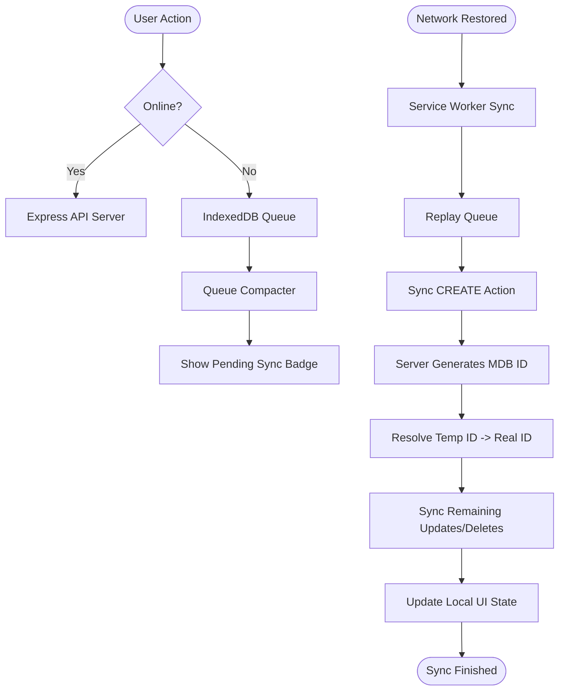

# 📓 My Journal App — Offline-First PWA

[](https://react.dev)
[](https://nodejs.org)
[](https://www.mongodb.com)
[](https://web.dev/progressive-web-apps/)
[](https://tailwindcss.com)

A premium, production-ready, offline-first personal journaling web application. This application features a custom offline synchronization engine, a dynamic Service Worker caching system, robust background push notifications, and a responsive custom-tailored layout matching modern design aesthetics.

---

## 📖 Table of Contents

- [🚀 Architecture Highlights](#-architecture-highlights)
- [📦 Core Technical Implementations](#-core-technical-implementations)
  - [1. Offline-First Sync & Queue Compaction](#1-offline-first-sync--queue-compaction)
  - [2. Temporary-to-Permanent ID Resolution](#2-temporary-to-permanent-id-resolution)
  - [3. Stale App Shell Cache Lockout Prevention](#3-stale-app-shell-cache-lockout-prevention)
  - [4. Dynamic Import Chunk Failure Recovery](#4-dynamic-import-chunk-failure-recovery)
  - [5. Web Push Notification Stack](#5-web-push-notification-stack)
- [🎨 Design & Typography](#-design--typography)
- [⚙️ Tech Stack](#%EF%B8%8F-tech-stack)
- [📁 Folder Structure](#-folder-structure)
- [🛠️ Local Installation & Setup](#%EF%B8%8F-local-installation--setup)
  - [1. Backend Setup](#1-backend-setup)
  - [2. Frontend Setup](#2-frontend-setup)

---

## 🚀 Architecture Highlights

The application is architected to survive network dropouts and provide a native-app-like experience. 



---

## 📦 Core Technical Implementations

### 1. Offline-First Sync & Queue Compaction
When offline, all user edits are intercepted and saved inside a local IndexedDB action queue. To prevent redundant API calls, a custom **Queue Compaction Algorithm** is executed before sync replay. If a user performs multiple actions on the same item while offline, the engine compacts them:
* `CREATE ➔ DELETE` ➔ Both actions are discarded (nothing to sync).
* `CREATE ➔ UPDATE` ➔ The payload is merged directly into the `CREATE` action.
* `UPDATE ➔ UPDATE` ➔ Only the final `UPDATE` action is preserved.
* `UPDATE ➔ DELETE` ➔ The `UPDATE` is discarded, and only the `DELETE` is sent.

### 2. Temporary-to-Permanent ID Resolution
When a new journal entry is created offline, the client generates a unique client-side temporary ID (e.g. `temp-17825807`). 
* Upon reconnecting, the worker replays the `CREATE` action.
* The backend database generates a permanent BSON `ObjectID` (e.g., `6a3d4799e0298660290bcca6`) and returns it.
* The sync engine intercepts this response and recursively updates all remaining queued downstream actions (like subsequent updates/deletions of that same item) to replace the temporary ID with the permanent ID before they are dispatched.
* It fires a sync-completed message to the React layer to seamlessly transition the local state keys.

### 3. Stale App Shell Cache Lockout Prevention
Standard PWA caches can cause app lockouts: when a new build is deployed with new bundle hashes, the browser still serves a cached stale `index.html` referencing deleted chunks, causing blank pages.
* This app implements a custom **Network-First** with **SWR (Stale-While-Revalidate)** fallback handler specifically for document navigation requests.
* Standard assets (fonts, icons, styles) check cache-first, but the document shell hits the network to inspect for new layouts before falling back to local offline caches.
* Service Worker lifecycle triggers (`skipWaiting` and `clients.claim`) are bound to activate new updates immediately.

### 4. Dynamic Import Chunk Failure Recovery
In modern bundle-split React apps, navigating to lazy-loaded pages while offline throws a `ChunkLoadError` because the chunk is not yet cached.
* We wrapped our React Router routing nodes in a specialized `ErrorBoundary` that captures chunk load failures.
* Instead of crashing, the app renders a beautiful offline state screen with dynamic status indicators and a "Retry Connection" handler.

### 5. Web Push Notification Stack
* **VAPID Key Protocol**: The backend signs push payloads using custom VAPID keys, communicating securely with browser push services (FCM/Mozilla).
* **Multi-User Endpoint Resolution**: Resolves subscription collisions on shared browsers (e.g., logging out user A and logging in user B) by mapping subscriptions uniquely to the endpoint.
* **Cron Service Reminder**: A server-side cron job executes at scheduled intervals to prompt registered users who haven't logged entries today.

---

## 🎨 Design & Typography
The UI has been redesigned to reflect custom premium lavender aesthetics:
* **Typography**: Imported `Plus Jakarta Sans` as the primary base font.
* **Custom Navigation**: Responsive top navbar containing clean horizontal tabs with inline SVGs, theme switchers, and profile avatars.
* **Segmented Settings Controls**: Mobilized the settings dashboard with a segmented navigation grid (General, Notifications, Reminders, Account) resembling native mobile controls.
* **Responsive Cards**: Optimized cards with compact styling, calendar date blocks, read-time calculations, and customized item action buttons.

---

## ⚙️ Tech Stack

| Layer | Technology | Purpose |
| --- | --- | --- |
| **Frontend** | React 19 (Vite) | Declarative UI components & fast compilation |
| **Authentication** | Better Auth SDK | Session validation, secure cookies & Google OAuth |
| **Styling** | Tailwind CSS v4 | Responsive utility classes & theme variables |
| **Database** | MongoDB & Mongoose | Document store with object modeling |
| **Offline Storage** | IndexedDB | Local action queue persistence |
| **Notifications** | Web Push & VAPID | Browser system push alerts |
| **Task Scheduling** | Node Cron | Automated daily reminders checks |
| **Documentation** | Swagger / OpenAPI | Interactive API route documentation |

---

## 📁 Folder Structure

```
MyJournalApp/
├── frontend/               # React client
│   ├── public/             # PWA assets (manifest.json, sw.js, icons)
│   ├── src/                
│   │   ├── components/     # UI elements (JournalCard, ErrorBoundary, etc.)
│   │   ├── context/        # Global Auth, Theme & PWA Install states
│   │   ├── pages/          # Home (Posts), Journals feed, and Settings pages
│   │   └── services/       # Offline sync managers & backend client endpoints
├── backend/                # Node.js/Express Server
│   ├── config/             # DB adapter & better-auth settings
│   ├── controllers/        # Express handlers (journals, push endpoints)
│   ├── middleware/         # Security guards & session validation
│   ├── models/             # Mongoose schemas (User, Journal, Subscription)
│   ├── routes/             # API Router definitions
│   ├── services/           # Background push dispatchers & daily reminder cron
│   └── swagger/            # OpenAPI/Swagger schema files
```

---

## 🛠️ Local Installation & Setup

### 1. Backend Setup
1. Navigate to the backend directory:
   ```bash
   cd backend
   ```
2. Install dependencies:
   ```bash
   npm install
   ```
3. Create a `.env` file in the `backend/` folder:
   ```env
   PORT=3000
   MONGODB_URI=mongodb://localhost:27017/myjournal
   VAPID_PUBLIC_KEY=your_vapid_public_key
   VAPID_PRIVATE_KEY=your_vapid_private_key
   BETTER_AUTH_SECRET=your_secret_key # e.g. openssl rand -hex 32
   BETTER_AUTH_URL=http://localhost:3000
   ```
4. Run the development server:
   ```bash
   npm run dev
   ```
5. View API docs: visit [http://localhost:3000/api-docs](http://localhost:3000/api-docs)

### 2. Frontend Setup
1. Navigate to the frontend directory:
   ```bash
   cd ../frontend
   ```
2. Install dependencies:
   ```bash
   npm install
   ```
3. Create a `.env` file in the `frontend/` folder:
   ```env
   VITE_API_URL=http://localhost:3000
   ```
4. Start Vite development server:
   ```bash
   npm run dev
   ```
5. Open the app at [http://localhost:5173/](http://localhost:5173/) or [http://localhost:5174/](http://localhost:5174/) (depending on active ports).

---

## 🐳 Containerization & Orchestration (Docker)

The application is fully containerized and orchestrated using **Docker** and **Docker Compose**, providing a single-command setup that launches the frontend, backend, and database in an isolated virtual network with persistent volumes.

### Orchestrated Services:
1. **`journal-database` (MongoDB 6.0)**: Standard MongoDB container persisting data inside a named Docker volume (`mongo-data`). Exposes port `27017`.
2. **`journal-backend` (Node.js / Express)**: Built from a lightweight `node:20-alpine` base image. It mounts the `./backend` source directory to allow hot-reloading and links to the database container. Exposes port `3000`.
3. **`journal-frontend` (Vite / React 19)**: Built from `node:20-alpine`. It starts the Vite dev server with a `--host` binding to expose the client outside the container network. Exposes port `5173`.

### Quickstart Container Environment:

1. **Verify Environment Configuration**: Ensure your `./backend/.env` and `./frontend/.env` files are configured.
2. **Build and Start Container Services**:
   ```bash
   docker-compose up --build -d
   ```
3. **Access Services**:
   - **PWA Web App**: [http://localhost:5173/](http://localhost:5173/)
   - **Express API Endpoint**: [http://localhost:3000/](http://localhost:3000/)
   - **Swagger API Docs**: [http://localhost:3000/api-docs](http://localhost:3000/api-docs)
4. **Stop Services & Delete Persistent Volumes**:
   ```bash
   docker-compose down -v
   ```
