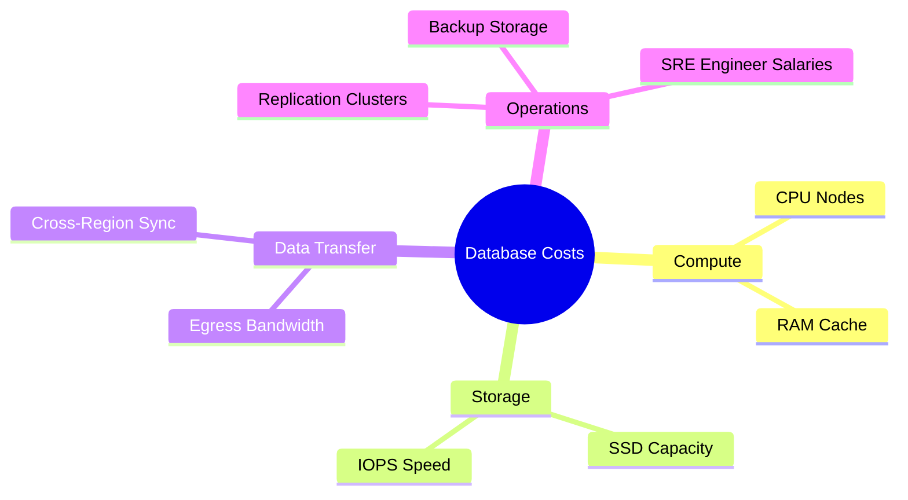
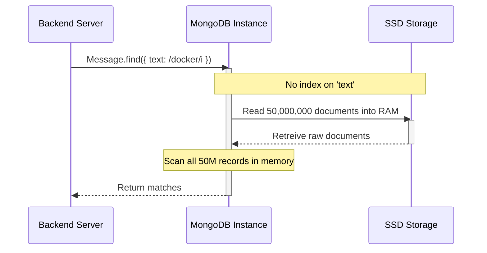
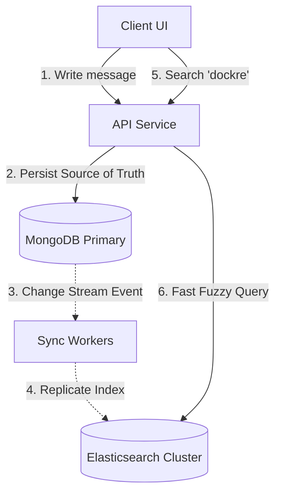

# Database & Search Infrastructure Costing — MongoDB, Atlas, Self-Hosting, Elasticsearch & Optimization

When designing large-scale search architecture for chat applications, developers must bridge the gap between software code and hardware costs. 

This guide details what drives infrastructure pricing, how code optimization directly impacts cloud bills, and how to make cost-effective architectural decisions at different user scales.

---

## 1. What Actually Costs Money in a Database?

A database is not an abstract cloud utility; it runs on physical or virtual servers. Every database query, storage block, and background replication task consumes hardware resources. 

The primary cost vectors are:



### Managed vs. Self-Hosted Infrastructure
The difference between MongoDB Atlas and self-hosting lies in **who manages the resources**:
*   **MongoDB Atlas**: You pay a premium for MongoDB Inc. to provision, manage, scale, secure, and monitor the cluster.
*   **Self-Hosted MongoDB**: You pay a cloud provider (e.g., AWS, GCP, DigitalOcean) for raw virtual machines (VMs/EC2) and storage. You assume 100% of the operational burden of setting up, maintaining, and recovering the database.

---

## 2. Does Every MongoDB Query Cost Money?

A common question is: *"If I execute a query like `Message.find({ chatId })`, am I billed a fraction of a cent for that individual operation?"*

The answer depends on the billing model:

```
                  ┌─────────────────────────────────────────┐
                  │          Database Billing Model         │
                  └────────────────────┬────────────────────┘
                                       │
            ┌──────────────────────────┴──────────────────────────┐
            ▼                                                     ▼
┌───────────────────────┐                             ┌───────────────────────┐
│   Dedicated Tier      │                             │    Serverless Tier    │
│  (Atlas M10+, VMs)    │                             │  (Atlas Serverless)   │
└───────────┬───────────┘                             └───────────┬───────────┘
            │                                                     │
            ▼                                                     ▼
┌───────────────────────┐                             ┌───────────────────────┐
│ Flat monthly cost for │                             │ Billed directly per   │
│ CPU/RAM provisioning. │                             │ million Read/Write    │
│ Indirect query cost.  │                             │ operations (RCUs/WCUs)│
└───────────────────────┘                             └───────────────────────┘
```

### Dedicated Instance Model (Flat-Rate Billing)
If you run MongoDB on a dedicated machine (e.g., MongoDB Atlas M10 or an AWS EC2 instance), you pay a flat monthly rate for the server's CPU, RAM, and disk space. You can run 1 query or 10,000,000 queries; the raw bill remains the same.
*   **The Catch**: If your queries are unoptimized, they consume excessive CPU and disk I/O. When the server hits 100% resource utilization, the system degrades. You are forced to upgrade to a larger, more expensive tier. **Queries cost money indirectly by driving resource depletion.**

### Serverless Model (Usage-Based Billing)
In serverless configurations, you are billed directly for operations:
*   **Read Units (RU)** and **Write Units (WU)** are metered.
*   A query scanning 1,000,000 documents to return 1 result costs significantly more than a query that uses an index to scan 1 document and return 1 result. **Here, bad queries cost money directly and immediately.**

---

## 3. Why Bad Queries Increase Cost (Unindexed Scan)

Suppose your chat database has <span style="color:#d9534f">**50 million messages**</span>. A user searches for the word *"docker"* using a global case-insensitive regular expression:

```js
// This triggers a full collection scan (COLLSCAN)
Message.find({ text: /docker/i });
```



### The Cost Chain of a COLLSCAN:
1.  **RAM Pressure**: MongoDB must load documents from disk into the cache (WiredTiger Cache) to process the regex.
2.  **Disk I/O Spike**: Reading gigabytes of raw data from SSDs consumes IOPS (Input/Output Operations Per Second). If you exceed your disk's provisioned throughput, queries stall.
3.  **CPU Exhaustion**: The CPU must evaluate the regex pattern against millions of strings, spiking server CPU utilization to 100%.

> [!CAUTION]
> **Cost Impact**: Running this query repeatedly forces you to upgrade from a basic machine (e.g., 2 vCPUs / 8 GB RAM at ~$80/mo) to a larger machine (e.g., 8 vCPUs / 32 GB RAM at ~$350/mo) to prevent database crashes.

---

## 4. How Indexes Reduce Cost (and Where They Add Cost)

Let us optimize the query by scoping the search to a specific conversation using an indexed field:

```js
// MongoDB will use the index on 'chatId'
Message.find({ chatId, text: /docker/i });
```

### The Optimized Scan Path:
Imagine a single chat contains only **800 messages** out of the 50,000,000 global messages.


By traversing the B-Tree index for `chatId`, MongoDB immediately pinpoints the memory locations of those 800 documents. The CPU only evaluates the regex 800 times.

*   **CPU Utilization**: Spikes from 100% down to < 1%.
*   **Disk Read**: Drops from gigabytes to kilobytes.

> [!TIP]
> **Cost Savings**: With clean indexes, a small $20/mo database server can easily handle the same throughput that would crash a $300/mo unindexed server.

### The Trade-off: Indexes Are Not Free
Every index you add introduces operational overhead:
*   <span style="color:#d9534f">**Write Amplification**</span>: When you insert a new message, MongoDB must write the document *and* update every B-Tree index associated with that collection.
*   <span style="color:#f0ad4e">**RAM Consumption**</span>: For optimal performance, indexes must fit entirely within the RAM cache (working set). If indexes grow larger than RAM, MongoDB must page them in and out of disk, causing latency spikes.
*   <span style="color:#d9534f">**Storage Overhead**</span>: Large text indexes can take up as much space as the raw data itself.

---

## 5. Storage and Network Bandwidth: The Hidden Costs

### Data Storage Cost Dynamics
When you store 100 GB of chat messages in production, you aren't paying for just 100 GB of disk space. You pay for:

$$\text{Total Storage Billing} = \text{Primary Data} + \text{Index Sizes} + (\text{Primary Data} \times 2 \text{ Replicas}) + \text{Backups}$$

In a standard 3-node replica set, 100 GB of data easily becomes **300+ GB of active cloud storage**, plus daily, weekly, and monthly incremental snapshot backups.

### Network Bandwidth & Presigned URLs
Data transfer between your app and the internet (Egress) is often the most overlooked cost. 

#### Bad Architecture (Proxying via Backend):
If files/images are sent through your backend server, you pay for network bandwidth twice:

```
Client (Upload) ──[Bandwidth Out]──> Backend ──[Bandwidth Out]──> S3/Cloud Storage
```

*   *Cost Impact*: Consumes CPU, RAM, and double the egress bandwidth on your API servers.

#### Cost-Optimized Architecture (Presigned URLs):
By generating a presigned upload URL, the backend only transfers a few bytes of metadata. The client uploads the file directly to object storage:

```
1. Client ──[Get Upload URL]──> Backend (Returns S3 Presigned URL)
2. Client ──[Upload File Directly]──[Bandwidth Out]──> S3/Cloud Storage
```

> [!TIP]
> **Egress Savings**: Moving file upload/download traffic directly to Cloud Storage using presigned URLs can reduce API gateway costs by **70% to 90%** at scale.

---

## 6. Managed (Atlas) vs. Self-Hosted Cost Comparison

| Operational Feature | MongoDB Atlas (Managed) | Self-Hosted (Raw VMs + EC2) |
| :--- | :--- | :--- |
| **Setup & Provisioning** | Click-to-deploy, automated clustering. | Manual scripting (Terraform/Ansible), installation. |
| **Failover & HA** | Automatic, multi-zone replica sets. | Manual replica set configuration, health-check scripts. |
| **Backups** | Automated, point-in-time recovery UI. | Cron jobs exporting to S3, manual script verification. |
| **Upgrades & Patches** | Zero-downtime, automated minor updates. | Manual staging, safe node rotation, risk of downtime. |
| **Hourly Server Cost** | Higher (Infrastructure cost + management premium). | Lower (Raw VM resource costs only). |
| **Engineering Cost** | Low. Existing developers can manage it. | High. Requires SRE/DBA personnel at scale. |

### The Engineering vs. Infrastructure Equation
It is easy to make a math error when evaluating self-hosting:
*   *Raw VM Cost*: \$150/month
*   *Equivalent Atlas Cost*: \$350/month
*   *Apparent Savings*: \$200/month by self-hosting.

> [!CAUTION]
> If a self-hosted database fails, who fixes it? A software engineer earning \$120,000/year costs the company roughly **\$60/hour**. If they spend 2 days configuring replica sets, diagnosing disk corruption, or restoring backups, the company has spent **\$960** in developer hours.
>
> **Rule of Thumb**: Use managed databases until the raw infrastructure premium exceeds the cost of hiring dedicated engineers to manage it.

---

## 7. Elasticsearch: Search Cluster Costing

To support global full-text search, typo tolerance, and phonetic matching across millions of messages, you replicate data into Elasticsearch.



### Why Elasticsearch Costs Extra Resources:
1.  **Workload Isolation (Cost Protection)**: By querying Elasticsearch for search, your primary database (MongoDB) is spared from heavy text processing. Core messaging performance (sending/receiving) remains fast and stable.
2.  **Double Storage**: Storing text indexes, term dictionaries, and inverted index lists on Elasticsearch requires duplicating message content.
3.  **Heavy RAM Usage**: Elasticsearch relies heavily on memory. It allocates a **JVM Heap** (for query execution, caching, and field data) and relies on the **OS Filesystem Cache** to store active index segments. 

> [!IMPORTANT]
> **RAM Sizing Rule**: Unlike popular belief, you do not need your entire index to fit in RAM. However, for fast searches, your *most frequently searched* index segments and term maps must reside in memory. If memory is too low, search speeds degrade to disk speeds.

---

## 8. Real-World Cost Projections (MAU Scaling Models)

The following matrix represents realistic industry averages (infrastructure, transfer, and operations) across different monthly active user (MAU) milestones for a chat application.

| Scale Metric | Tier 1: Startup / MVP (1K MAU) | Tier 2: Mid-Scale Growth (50K MAU) | Tier 3: High Scale (1M MAU) | Tier 4: Enterprise (10M+ MAU) |
| :--- | :--- | :--- | :--- | :--- |
| **Peak Load** | < 5 messages/sec | 50 - 100 messages/sec | 1,000 - 2,000 messages/sec | 15,000+ messages/sec |
| **MongoDB Tier** | **Atlas Shared (M0 / M2)** | **Atlas M20 (Dedicated)**<br>2 vCPUs / 4GB RAM | **Atlas M40 Replica Set**<br>4 vCPUs / 16GB RAM (3 nodes) | **Atlas M80 Sharded Cluster**<br>32 vCPUs / 128GB RAM (9 nodes) |
| **Search Setup** | None (MongoDB basic regex) | **Elastic Cloud (Single Node)**<br>2GB RAM / 30GB Disk | **Elastic Cloud Cluster**<br>8GB RAM (3 nodes, HA) | **Self-Hosted Dedicated ES**<br>32GB RAM (6 data + 3 master) |
| **Monthly DB Cost**| \$0 - \$15 | \$110 | \$430 | \$7,200 |
| **Monthly Search Cost**| \$0 | \$45 | \$240 | \$2,800 |
| **Estimated Egress/Bandwidth**| \$2 | \$35 | \$180 | \$2,500 |
| **DevOps / DBA Cost (FTE hours)**| 0 hours | ~2 hours (\$120) | ~15 hours (\$900) | 2 Dedicated Engineers (\$25,000) |
| **Total Effective Cost / Mo**| **\$2 - \$17** | **\$300** | **\$1,750** | **\$37,500** |

---

## 9. High-Impact Backend Optimization Principles (Doing Less Work)

One of the most effective ways to think about backend optimization is: **don't just reduce latency milliseconds—reduce unnecessary work.** Less work directly translates to lower CPU, RAM, storage, I/O, and network egress costs.

Below are 15 high-impact, real-world optimization principles tailored for your chat application:

1.  **Query Only What You Need**: Avoid fetching entire documents or huge histories. Use MongoDB projections (e.g., `.select({ text: 1, senderId: 1 })`) to exclude unused fields, and limit returned rows. If the UI needs 30 messages, never fetch 3,000.
2.  **Design Indexes Around Query Patterns**: Build indexes specifically to support your queries (e.g., a compound index like `{ conversationId: 1, createdAt: -1 }` to support chat history pagination). <span style="color:#d9534f">**Do not index every field**</span>—unnecessary indexes consume memory/RAM and increase write overhead.
3.  **Cursor-Based Pagination**: Avoid large offset-based pagination (`skip(100000).limit(20)`). Use cursor pagination (querying messages where `_id < lastSeenId`) to prevent MongoDB from reading and discarding thousands of records to reach the target page.
4.  **Avoid N+1 Database Queries**: Do not fetch 50 messages and then execute a separate database query for each message's sender to get their avatar/name. Batch queries using `$in` queries (e.g., fetching all senders in one single query) or denormalize small, immutable user fields directly into the message schema if justified.
5.  **Cache Selectively, Not Blindly**: Caching layers like Redis can dramatically reduce database reads, but Redis instances cost money. Cache data that is read frequently and changes infrequently. <span style="color:#f0ad4e">**Do not introduce caching**</span> simply because it sounds "scalable"—verify that database load reductions justify the Redis node cost.
6.  **Keep Large Files out of the Database**: Store images, videos, PDFs, and voice notes in external object storage (e.g., AWS S3, Cloudinary). Only store the metadata and direct URLs in your MongoDB documents.
7.  **Direct Uploads to Object Storage**: Leverage Level-3 upload architectures using presigned URLs:
    ```
    Client ──> Uploads directly to S3
    ```
    instead of proxying files through your application server:
    ```
    Client ──> Node API ──> S3
    ```
    This shields backend APIs from high CPU usage, memory buffers, and double network egress costs.
8.  **Match Search Architecture to Scale**: <span style="color:#5cb85c">**Avoid deploying Elasticsearch**</span> for a 1,000-user app. Use scoped, indexed MongoDB text searches until search traffic volumes and complex features (typo tolerance, phonetic matching) justify the additional cost of a dedicated cluster.
9.  **Archive and Tier Old Data**: A 5-year-old inactive chat does not need to sit on high-speed, expensive SSDs. Move cold data (e.g. archived chats) to cheaper, cold storage classes, keeping only recent "hot" active data on the primary transactional database tier.
10. **Minimize Network Payload Size**: Return only the fields needed by the API clients. Compress images on the client or via an image pipeline, use modern media formats (WebP, WebM), and avoid repeatedly transferring static data. Network bandwidth egress is a primary cloud cost driver.
11. **Eliminate Client Polling**: For real-time applications, HTTP polling (asking `/messages` every 3 seconds) creates massive, unnecessary server workloads. Implement persistent WebSocket connections so the server pushes events to clients only when they occur.
12. **Batch Operations**: Instead of executing dozens of tiny, independent database or API operations, batch them. For example, batch push notifications, telemetry logs, or analytical database writes to reduce network roundtrip overhead and database lock congestion.
13. **Set Time-to-Live (TTL) Policies**: Ephemeral data like OTP tokens, temporary upload chunks, expired sessions, typing indicators, and logs should not live forever. Setup MongoDB TTL indexes to automatically prune old data and reclaim storage space.
14. **Control Logging and Observability Costs**: Writing massive JSON request bodies, debug logs, or WebSocket payloads to your production logging system (e.g., Datadog, Logstash) is extremely expensive. Establish appropriate log levels, log sampling rates, and short retention periods.
15. **Measure Before Optimizing**: Use profiling tools to monitor database connections, slow queries, cache hit rates, and disk I/O. <span style="color:#f0ad4e">**Do not guess**</span> where the bottlenecks are. Spending money on complex optimizations (like caching) is wasteful if a simple compound index solves the bottleneck.

---

### Core Cost Optimization Summary

```text
Cost Optimization
      │
      ├── Do less work (indexes, pagination, queries)
      ├── Store less unnecessary data (TTLs, archiving, metadata-only)
      ├── Transfer less data (presigned URLs, compression, payloads)
      ├── Reuse computed results when worthwhile (selective caching)
      ├── Use cheaper resources for cold workloads (data tiering)
      └── Scale only what actually needs scaling (workload isolation)
```

> [!IMPORTANT]
> **The Golden System Design Principle**: The cheapest infrastructure service is the one you **do not need to deploy**. Adding Redis, Apache Kafka, Elasticsearch, or extra replica sets are highly effective when addressing verified scale limits—not simply because large tech companies use them.

