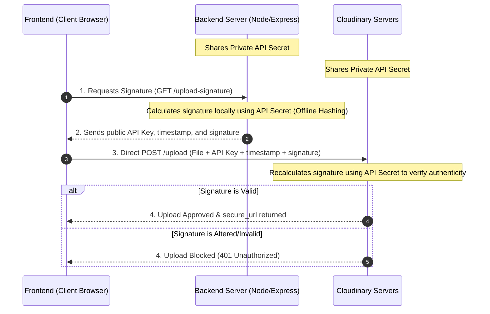

# File Sharing: Downloading vs. Streaming

Here is a breakdown of the differences between standard file buffering and upload streaming.

---

### 1. Movie Analogy: Downloading vs. Streaming
Imagine you want to watch a 2-hour movie on your computer:
* **The "Downloading" (Buffering) Way**: You click download. You must wait for the entire 2GB file to finish downloading to your hard drive. Once it is 100% finished, you can finally open and play the video.
* **The "Streaming" (YouTube/Netflix) Way**: You click play. You start watching the first 5 seconds immediately. The player loads the next 5 seconds in the background as you watch. You do not need to wait for the whole movie to download, and your computer doesn't need to load the entire 2GB file into memory at once.

---

### 2. How it works with Server File Uploads
When a user uploads a large file (e.g., a 100MB video) to your application:

#### Without Streaming (Buffering)
1. The user's browser starts uploading the file to your server.
2. Your server waits until it receives all 100MB of the file. It saves the entire 100MB into its RAM (memory) or writes it to a temporary file on its hard drive.
3. Once the server has the complete file, it starts uploading the file to Cloudinary/S3.
4. Once Cloudinary receives the full file, it tells the server, and the server tells the user "Upload complete!"

> [!WARNING]
> **Problem**: If 10 users upload files at once, your server needs 1GB of RAM just to hold these files temporarily. If your server is small, it will crash.

#### With Streaming
1. The user's browser starts uploading the file.
2. As soon as your server receives the first tiny chunk (e.g., 16KB), it immediately forwards (pipes) that 16KB chunk to Cloudinary.
3. The server does not keep the chunk. It acts like a water pipe: water enters one end and flows out the other. The pipe itself doesn't store the water.
4. This continues chunk-by-chunk until the file is complete.

> [!TIP]
> **Benefit**: Your server only uses 16KB of RAM, no matter how huge the file is! And the upload is much faster because the server starts uploading to Cloudinary immediately instead of waiting.

---

### 3. What is Multer's role?
* **The Browser (Frontend)** is the one that sends the file data over the network in chunks.
* **Multer** is a library that runs on your **backend server**. It acts as the parser. It reads the incoming request stream, extracts the text fields and file chunks, and helps you handle them (either by saving them to disk, keeping them in RAM buffer, or helping you stream them elsewhere).

---

### 4. Production Upload Architectures (Scale Levels)

As web applications grow, the way files are transferred must evolve to protect server RAM, CPU, and bandwidth. Here are the three primary levels:

#### Level 1: Buffer Uploading (Small Scale)
* **Flow:** Client Upload ──> Server RAM (Buffer) ──> Cloud Storage (Cloudinary/S3).
* **Details:** The server downloads the entire file, stores it in RAM (`req.file.buffer`), and then uploads it to the cloud.
* **Verdict:** Easiest to write, works perfectly for small uploads (< 15MB), but can crash the server if many users upload large files at once.

#### Level 2: Upload Streaming (Medium Scale)
* **Flow:** Client Upload ──> Server Stream Pipe ──> Cloud Storage.
* **Details:** The server parses the incoming request bytes on-the-fly and immediately pipes (forwards) them to the cloud. The file is never fully held in the server's RAM.
* **Verdict:** Highly RAM-efficient, but still consumes the server's CPU and internet network bandwidth.

#### Level 3: Direct Client Upload via Signed Parameters (High Scale / Enterprise)
* **Flow:** Client ──[ Request Signature ]──> Server (Local Hashing) ──[ Return Signature ]──> Client ──[ Direct Upload with Signature ]──> Cloud Storage.
* **Details:**
  1. The client requests upload authorization from the backend.
  2. The backend signs the upload parameters (folder, timestamp) locally using the private **API Secret** (completely offline, without contacting Cloudinary's servers).
  3. The client uploads the file directly to Cloudinary, sending the file, the signature, and the public **API Key**.
  4. Cloudinary uses the shared **API Secret** to verify the signature on its side. If valid, the file is saved and a secure URL is returned.
* **Verdict:** The gold standard for production. The backend server uses **0 RAM, 0 CPU, and 0 network bandwidth** for the file transfer.




> [!TIP]
> **Active Implementation:** Our ChatApp currently implements **Level 3 (Direct Client Upload via Presigned URLs)**. The frontend fetches a cryptographic signature from `/api/chat/upload-signature` and uploads media directly to Cloudinary, completely bypassing our backend server.

---

### 5. Cloudinary vs. AWS S3
For a chat application, we use both Cloudinary and S3 depending on the file type:
* **Cloudinary**: Best for profile avatars, chat images, and voice notes. It automatically compresses and optimizes media files, and supports dynamic transformations.
* **AWS S3**: Best for raw document attachments (PDFs, ZIPs, Word docs) where optimization is unnecessary.

---

### 5. Code Cheat Sheet

#### Cloudinary Stream Upload
```javascript
import { v2 as cloudinary } from 'cloudinary'

const uploadToCloudinary = (fileStream, folderName) => {
  return new Promise((resolve, reject) => {
    const uploadStream = cloudinary.uploader.upload_stream(
      { folder: folderName, resource_type: 'auto' },
      (error, result) => {
        if (error) {
          reject(error)
          return
        }
        resolve(result)
      }
    )
    fileStream.pipe(uploadStream)
  })
}
```

#### AWS S3 Multipart Stream Upload (AWS SDK v3)
```javascript
import { S3Client } from '@aws-sdk/client-s3'
import { Upload } from '@aws-sdk/lib-storage'

const s3Client = new S3Client({
  region: process.env.AWS_REGION,
  credentials: {
    accessKeyId: process.env.AWS_ACCESS_KEY_ID,
    secretAccessKey: process.env.AWS_SECRET_ACCESS_KEY
  }
})

const uploadToS3 = async (fileStream, key, mimeType) => {
  const upload = new Upload({
    client: s3Client,
    params: {
      Bucket: process.env.AWS_BUCKET_NAME,
      Key: key,
      Body: fileStream,
      ContentType: mimeType
    }
  })
  return await upload.done()
}
```

#### Axios Frontend Upload Progress (React)
```javascript
import axios from 'axios'

const uploadFileWithProgress = async (file, onProgressUpdate) => {
  const formData = new FormData()
  formData.append('file', file)

  const response = await axios.post('/api/upload', formData, {
    onUploadProgress: (progressEvent) => {
      if (progressEvent.total) {
        const percentCompleted = Math.round(
          (progressEvent.loaded * 100) / progressEvent.total
        )
        onProgressUpdate(percentCompleted)
      }
    }
  })
  return response.data
}
```

#### Native XMLHttpRequest Upload Progress & Cancellation (React)
When you want to avoid adding a heavy third-party library like Axios to your project, you can use the browser's native `XMLHttpRequest` (XHR) API. It offers built-in support for progress tracking and aborting (cancelling) active transfers.

```javascript
const uploadFileWithXHR = (file, onProgressUpdate, abortSignal) => {
  return new Promise((resolve, reject) => {
    const xhr = new XMLHttpRequest()
    const formData = new FormData()
    formData.append('file', file)

    xhr.open('POST', '/api/upload')

    // 1. Monitor progress via the upload object
    if (xhr.upload && onProgressUpdate) {
      xhr.upload.onprogress = (event) => {
        if (event.lengthComputable) {
          const percent = Math.round((event.loaded * 100) / event.total)
          onProgressUpdate(percent)
        }
      }
    }

    // 2. Setup cancellation listener (via AbortSignal)
    if (abortSignal) {
      abortSignal.addEventListener('abort', () => {
        xhr.abort()
        reject(new DOMException('Upload aborted by user', 'AbortError'))
      })
    }

    // 3. Handle success and error statuses
    xhr.onload = () => {
      if (xhr.status >= 200 && xhr.status < 300) {
        resolve(JSON.parse(xhr.responseText))
      } else {
        reject(new Error(`Upload failed with status ${xhr.status}`))
      }
    }

    xhr.onerror = () => reject(new Error('Network error during upload'))

    // 4. Send the request payload
    xhr.send(formData)
  })
}
```

