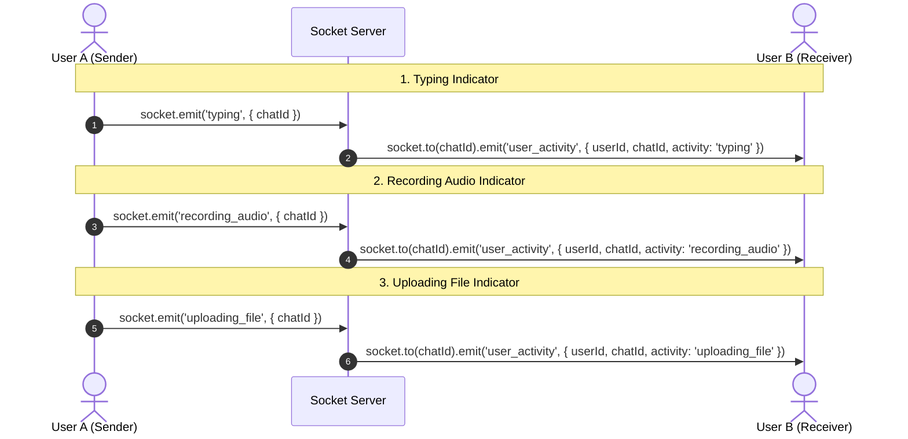

# 🟢 Phase 12: Presence Extensions — Deep Dive & Learning Guide

Welcome to **Phase 12: Presence Extensions**! In this phase, we elevate real-time communication beyond basic "Online/Offline" statuses to rich, live user activity indicators (e.g., *Typing...*, *Recording audio...*, *Uploading file...*) and robust heartbeat synchronization.

---

## 🧠 Part 1: Core Concepts & Architecture

### 1. Activity & Presence Synchronization
In real-time chat applications, **Presence** consists of two tiers:
- **Static / Persistent Status**: `online`, `away`, `offline` (with `lastSeen` timestamp stored in database).
- **Transient Activity State**: Short-lived actions taking place *right now* in a specific conversation (e.g., `typing`, `recording_audio`, `uploading_file`).

#### How Transient Activities Work (Event Lifecycle)
1. **Client Event Trigger**: When a user performs an action (e.g., types in the text input, presses the mic record button, or starts uploading a file), the frontend emits a socket event.
2. **Server Room Routing**: The server forwards the event **only** to the specific conversation room (`socket.to(chatId).emit(...)`).
3. **Auto-Expiration / Timeout**: Because network drops or app crashes can happen mid-action (e.g., user closes tab while recording audio), the receiver client or server must set a timer (e.g., 3–5 seconds) to automatically clear the indicator if no `stop_*` event or continuous heartbeats arrive.

---

### 2. Heartbeat Optimization & Connection Health

#### The Problem: Silent Disconnections
When a user loses internet connectivity, closes their laptop lid, or switches to airplane mode on a mobile device, a TCP `FIN` handshake is often **never sent**. The socket connection remains standardly "open" on the server until the underlying TCP connection times out (which can take minutes!).

#### The Solution: Socket Ping / Pong & Custom Heartbeats
Socket.IO built-in ping/pong operates at the engine level (`pingInterval` and `pingTimeout` options):
- `pingInterval`: How often server sends a ping to the client (e.g., 25,000 ms).
- `pingTimeout`: How long server waits for client pong before declaring socket dead (e.g., 20,000 ms).

```
Server ------------------- Ping ------------------> Client
Server <------------------- Pong ------------------ Client
```

#### Multi-Tab Heartbeat & Presence Guarding
In multi-tab scenarios:
- `activeConnections` maps `userId -> Set<socketId>`.
- When Tab 1 disconnects, `userSockets.size` becomes `2` (user is **still online**).
- User only transitions to `offline` when `userSockets.size === 0`.

---

### 3. Presence Caching

In large-scale applications:
- Querying MongoDB every time a user requests presence or updates last seen is slow and expensive for database IOPS.
- **In-Memory Caching (Map / Redis)**: Presence should be read & updated directly in fast RAM (e.g., Node.js `Map` in single instance or **Redis Key-Value store** when scaling horizontally across multiple servers).

---

## 🛠️ Part 2: Implementation Blueprint for Phase 12 Build Tasks

Here is how the 4 build items in Phase 12 are implemented:



### 1. Generic Activity Event Pattern (Backend)

Instead of creating 10 separate socket listeners (`typing`, `stop_typing`, `recording`, `stop_recording`), we can implement a clean, unified activity handler in `socketService.js`:

```javascript
// Universal activity handler
socket.on('user_activity', ({ chatId, activity, isActionActive }) => {
  // activity can be: 'typing' | 'recording_audio' | 'uploading_file'
  if (isActionActive) {
    socket.to(chatId).emit('user_activity_updated', {
      userId,
      username: socket.username,
      chatId,
      activity
    })
  } else {
    socket.to(chatId).emit('user_activity_cleared', {
      userId,
      chatId,
      activity
    })
  }
})
```

---

### 2. Frontend Activity Throttling & Auto-Clear (React Hook)

On the client side, we use **debouncing** or auto-clearing timers to prevent spamming the socket server while typing or recording.

#### Typing Debounce Pattern:
- On every keystroke in `textarea`:
  1. Emit `user_activity` with `activity: 'typing'`, `isActionActive: true` (only if not already emitted).
  2. Reset a `typingTimeout` timer for **2.5 seconds**.
  3. When timer fires, emit `isActionActive: false` to clear the typing status.

---

### 3. Summary of Event Flow for Phase 12

| Activity | Start Trigger | Stop Trigger | UI Feedback on Receiver |
| :--- | :--- | :--- | :--- |
| **Typing** | `onChange` in message input | 2.5s idle OR message sent | *"Alice is typing..."* |
| **Recording** | Press Mic Record button | Stop / Send / Cancel recording | *"Alice is recording audio..."* |
| **Uploading** | File attachment upload starts | Cloudinary upload completes / fails | *"Alice is uploading a file..."* |
| **Heartbeat** | Periodic Socket Ping | Socket Disconnect | Real-time Online / Offline status badge |

---

## 🔍 Part 3: Activity Detection Triggers (Brief Summary)

### How We Detect Actions on Frontend:

1. **⌨️ Typing**:
   - **Start**: React `onChange` fires on input field & `useEffect` emits `typing: true` when `inputText.trim()` is non-empty.
   - **Stop**: A `setTimeout` debounces 2.5 seconds of input inactivity (or message submission) to emit `typing: false`.

2. **🎙️ Recording Audio**:
   - **Start**: Mic button click calls `startRecording()` -> `MediaRecorder.start()` fires & emits `recording_audio: true`.
   - **Stop**: Send/Cancel click calls `stopRecording()` -> `MediaRecorder.stop()` fires & emits `recording_audio: false`.

3. **📁 Uploading File**:
   - **Start**: Media preview Send click calls `startMediaUpload()` -> Cloudinary HTTP upload starts & emits `uploading_file: true`.
   - **Stop**: `finally` block executes after HTTP upload resolves/rejects & emits `uploading_file: false`.
