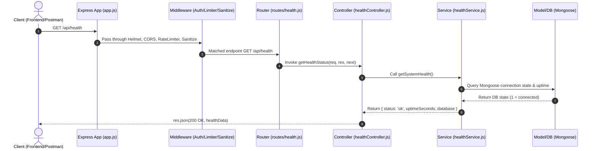

# Backend Architecture & Request Lifecycle Guide

This document explains the architecture of the backend application, detailing the purpose and responsibility of each folder, and illustrating the complete request/response lifecycle.

---

## 🏗️ Core Architecture Overview

The backend is built following the **Layered & Decoupled Architecture** (also known as standard 4-Tier + Cross-Cutting Utilities pattern). This separation ensures:
- **Testability**: Business logic can be unit-tested without mocking Express HTTP `req`/`res` objects.
- **Reusability**: Services can be called by REST routes, WebSockets, background cron jobs, or CLI tools.
- **Maintainability**: Clear boundaries prevent files from becoming monolithic and unmaintainable.

---

## 📁 The 8 Backend Directories & Their Responsibilities

### 1. `routes/` — The Traffic Cop (Routing Layer)
- **Role**: Maps incoming HTTP requests (URL paths + HTTP verbs like `GET`, `POST`, `PATCH`, `DELETE`) to specific controller functions.
- **Responsibilities**:
  - Defines public vs protected route boundaries.
  - Mounts route-level middleware (e.g., authentication, rate limiters).
  - Contains **NO** business logic or database queries.
- **Example Files**: `routes/chat.js`, `routes/user.js`, `routes/health.js`

### 2. `controllers/` — The HTTP Adapter (Transport Layer)
- **Role**: Acts as the bridge between the HTTP web protocol and your core application logic.
- **Responsibilities**:
  - Reads request data (`req.params`, `req.query`, `req.body`, `req.file`, `req.userId`).
  - Calls the corresponding Service function.
  - Formats and sends HTTP responses (`res.json(...)`, `res.status(200)`).
  - Catches errors and forwards them to Express global error handler (`next(error)`).
  - Contains **NO** direct database queries or complex calculations.
- **Example Files**: `controllers/authController.js`, `controllers/chatController.js`, `controllers/healthController.js`

### 3. `services/` — The Brain (Business Logic Layer)
- **Role**: Encapsulates core business rules, algorithms, and orchestration.
- **Responsibilities**:
  - Executes calculations, data transformations, third-party API integrations (e.g., Cloudinary, Push notifications).
  - Orchestrates calls to one or multiple Database Models.
  - Completely decoupled from Express (`req` and `res` never exist here).
- **Example Files**: `services/authService.js`, `services/socketService.js`, `services/healthService.js`

### 4. `models/` — Data Persistence Layer
- **Role**: Defines data schemas and manages direct database interactions (Mongoose/MongoDB).
- **Responsibilities**:
  - Specifies document schemas, field types, validation constraints, default values, and indexes.
  - Executes raw database queries (`find`, `findByIdAndUpdate`, `aggregate`, `save`).
- **Example Files**: `models/userModel.js`, `models/chatModel.js`, `models/messageModel.js`

### 5. `middleware/` — Security & Inspection Checkpoints
- **Role**: Functions that intercept requests along the execution pipeline before reaching controllers.
- **Responsibilities**:
  - **Authentication & Authorization**: Verifies JWT/session tokens and attaches user details to `req.userId` (`middleware/auth.js`).
  - **Rate Limiting**: Throttles abuse and DDoS attempts (`middleware/rateLimiters.js`).
  - **Input Cleaning**: Escapes XSS characters & strips MongoDB query injection operators (`utils/sanitize.js`).
  - **Global Error Handling**: Catches uncaught errors and outputs standardized JSON responses (`middleware/errorHandler.js`).
- **Example Files**: `middleware/auth.js`, `middleware/rateLimiters.js`, `middleware/errorHandler.js`

### 6. `validators/` — Input Payload Inspector
- **Role**: Ensures incoming request payloads strictly conform to expected schemas before processing.
- **Responsibilities**:
  - Validates required fields, email formats, string lengths, and parameter types.
  - Rejects malformed requests early with a `400 Bad Request` before hitting controllers or database logic.
- **Example Files**: `validators/authValidator.js`, `validators/chatValidator.js`

### 7. `config/` — System Control Panel & SDK Setup
- **Role**: Manages application configuration, environment settings, and connection initializations.
- **Responsibilities**:
  - Establishes MongoDB database connections (`config/db.js`).
  - Configures authentication SDKs (Better Auth `config/auth.js`).
  - Loads environment variables (`dotenv`).
- **Example Files**: `config/db.js`, `config/auth.js`

### 8. `utils/` — Cross-Cutting Utility Toolbox
- **Role**: Generic, standalone helper functions that can be used across any layer of the application.
- **Responsibilities**:
  - Provides custom error classes with HTTP status codes (`utils/AppError.js`).
  - Text & object sanitization functions (`utils/sanitize.js`).
  - Date formatting, string manipulators, or math helpers.
- **Example Files**: `utils/AppError.js`, `utils/sanitize.js`

---

## 🔄 Complete Request Lifecycle Diagram

### ASCII Pipeline View

```
[ Client / Browser ]
         │
         │ HTTP GET /api/health
         ▼
┌──────────────────────────────────────────────────────────┐
│  EXPRESS PIPELINE (app.js)                              │
│                                                          │
│  1. Global Security Middleware:                          │
│     cors() ➔ helmet() ➔ globalLimiter()                 │
│                                                          │
│  2. Request Parsers & Sanitizer:                         │
│     express.json() ➔ cookieParser() ➔ sanitizeMiddleware  │
└──────────────────────────┬───────────────────────────────┘
                           │
                           ▼
┌──────────────────────────────────────────────────────────┐
│  ROUTE LAYER (routes/health.js)                          │
│     Matches GET "/api/health" ➔ getHealthStatus          │
└──────────────────────────┬───────────────────────────────┘
                           │
                           ▼
┌──────────────────────────────────────────────────────────┐
│  CONTROLLER LAYER (controllers/healthController.js)      │
│     Calls healthService.getSystemHealth()                │
└──────────────────────────┬───────────────────────────────┘
                           │
                           ▼
┌──────────────────────────────────────────────────────────┐
│  SERVICE LAYER (services/healthService.js)               │
│     Calculates process.uptime() & checks Mongoose state  │
└──────────────────────────┬───────────────────────────────┘
                           │
                           ▼
┌──────────────────────────────────────────────────────────┐
│  MODEL / DATABASE LAYER (Mongoose ➔ MongoDB Atlas)      │
│     Reads connection state (1 = connected)               │
└──────────────────────────┬───────────────────────────────┘
                           │
                           ▼
┌──────────────────────────────────────────────────────────┐
│  RESPONSE PIPELINE                                       │
│     Controller returns res.json({ status: "ok", ... })   │
└──────────────────────────┬───────────────────────────────┘
                           │
                           ▼
[ 200 OK JSON Response to Client ]
```

---

### Mermaid Sequence Diagram



---

## 💡 Quick Reference: Where Should Code Live?

| Question | Destination Directory |
|---|---|
| "Where do I add a new API URL endpoint?" | `routes/` |
| "Where do I read `req.body` and set `res.status(200)`?" | `controllers/` |
| "Where do I write calculations or Cloudinary upload logic?" | `services/` |
| "Where do I define database schema fields and indexes?" | `models/` |
| "Where do I check user JWT tokens or throttle requests?" | `middleware/` |
| "Where do I validate email format and password length?" | `validators/` |
| "Where do I initialize DB connection strings or OAuth credentials?" | `config/` |
| "Where do I put reusable helper functions like `AppError`?" | `utils/` |
