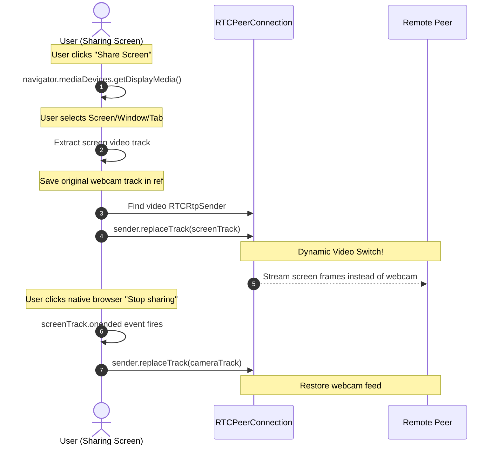

# WebRTC Screen Sharing (Technical Summary)

This document explains how WebRTC Screen Sharing is implemented in our ChatApp, detailing the media capture APIs and track replacement workflow.

---

## 🖥️ Screen Sharing Workflow

WebRTC allows us to share desktop displays dynamically by replacing the video track on the active connection in-place, without disconnects or renegotiating the connection.



---

## 🛠️ Step-by-Step Code Walkthrough

The logic is orchestrated inside [CallContext.jsx](file:///c:/Users/mrsan/Desktop/Boilerplate/frontend/src/context/CallContext.jsx):

### 1. Acquiring Display Media
We query the browser for the desktop video stream using `getDisplayMedia`:
```javascript
const screenStream = await navigator.mediaDevices.getDisplayMedia({ video: true });
const screenTrack = screenStream.getVideoTracks()[0];
```
This launches the native operating system prompt listing display windows.

### 2. Saving the Camera Track
Before overwriting the active stream, we save the webcam track so we can return to it when screen sharing is toggled off:
```javascript
originalVideoTrackRef.current = localStreamRef.current.getVideoTracks()[0];
```

### 3. Replacing the Active Connection Track
Instead of tearing down the call, WebRTC has **`RTCRtpSender`** objects which control how tracks are transmitted. We search for the active video sender and swap the track:
```javascript
const sender = peerConnectionRef.current.getSenders().find(s => s.track && s.track.kind === 'video');
if (sender) {
  sender.replaceTrack(screenTrack);
}
```
The remote user's feed immediately updates with the shared screen, maintaining the audio session without lag.

### 4. Updating Local Previews
We swap the tracks on the client's local stream container so the PiP (Picture-in-Picture) video container switches to display the screen:
```javascript
localStreamRef.current.removeTrack(originalVideoTrackRef.current);
localStreamRef.current.addTrack(screenTrack);
```

### 5. Handling Browser Native Disconnects
The browser displays a native system control strip (e.g., *"Stop sharing"*). If clicked, the track fires `onended`. We capture this event to restore the camera automatically:
```javascript
screenTrack.onended = () => {
  toggleScreenShare(); // Restores original webcam track
};
```
