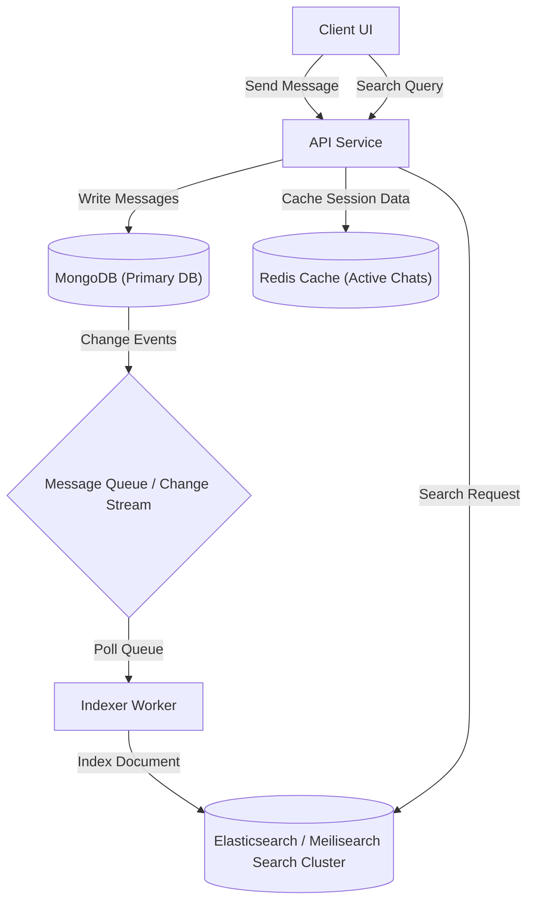
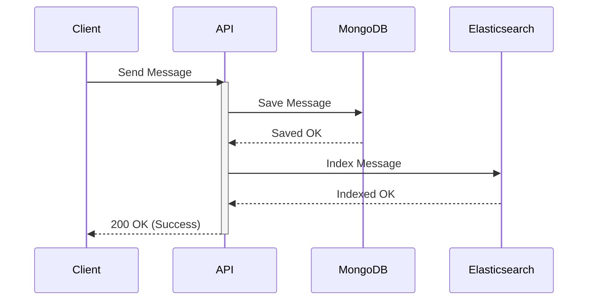
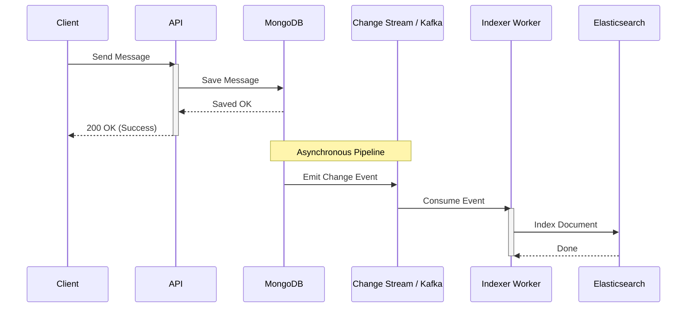

# Search Indexing in Chat Applications

This document outlines the three main architectural approaches to implementing search in real-time chat applications, along with their trade-offs and key design FAQs.

---

## 1. The Three Architectural Approaches

### Approach A: Regex Queries (Local Scan)
*   **Concept**: Pattern matching using regular expressions directly on text fields (e.g., `{ text: { $regex: query, $options: 'i' } }`).
*   **Pros**: Zero write overhead, no disk/memory storage costs, and extremely simple to code.
*   **Cons**:
    > [!CAUTION]
    > **Performance Bottleneck (Full Table Scan)**: If executed globally across the entire database, it triggers a collection-wide scan, reading every single document in memory. This causes massive database CPU spikes. It is only viable when filtered strictly by an indexed `chatId` to isolate the scan to a single conversation.

---

### Approach B: Native MongoDB Text Indexing
*   **Concept**: MongoDB automatically parses sentences into root words (tokenization & stemming) and maintains a hidden inverted index map pointing words to document IDs.
*   **Pros**: Rapid lookup speeds for word search without reading text documents during search.
*   **Cons**:
    > [!CAUTION]
    > **Write Amplification & Storage Overhead**: Every message insertion requires updating the index tree. This slows down write speeds (`Message.create()`), increases RAM consumption (as indexes must fit in memory), and increases disk usage by storing duplicate string keys.
    > 
    > **No Typo Tolerance**: Searching for `"dinosaur"` will not match `"dinosour"`. Typo matching is non-existent.

---

### Approach C: Dedicated Search Engines (Slack/Discord Scale)
*   **Concept**: Decoupled search architecture where messages are saved in MongoDB and concurrently replicated (via Change Streams/Message Queues) to a dedicated search cluster (e.g. Elasticsearch or Meilisearch).
*   **Pros**: Blazing fast search, phonetic matching, typo tolerance, advanced filters, and zero CPU load on the primary transactional database.
*   **Cons**:
    > [!CAUTION]
    > **High Complexity & Infrastructure Cost**:
    > *   **Synchronization overhead**: Sync workers must handle eventual consistency lags, and updates/deletions of messages must be manually synced to prevent deleted messages from leaking in search results.
    > *   **High Hosting Costs**: Elasticsearch requires significant RAM (usually minimum 2GB to 4GB per node) to keep the search index in memory. This adds another server to your monthly hosting bill.

---

## 2. Common Architectural Doubts & FAQs

### Q1: Does MongoDB scan the entire message database for every Regex query?
Only if you do a global search. If you do a local search (within one chat window) and index `chatId`, MongoDB uses the index to filter messages by `chatId` first, reducing the scan scope from millions of messages to just a few hundred.

### Q2: Does MongoDB create indexes for every new unique word?
Yes, for text indexes (Approach B). It splits sentences, strips "stop words" (e.g., *a, the, is, am*), and creates a row in its dictionary map for every unique root word it finds. This is why text indexes grow large.

### Q3: How are typos managed in search?
In basic indexes (Approach B) and regex (Approach A), they are not. In Approach C, engines like Elasticsearch use algorithms like **Levenshtein Distance** (Edit Distance) and **Phonetic Analysis** (converting words to sound codes like `TNSR` for both "dinosaur" and "diinosor") to find typo matches.

### Q4: Does updating indexes on every message increase hosting costs?
Yes. Synchronous index updates increase database write cycles (disk IOPS) and require keeping the index tables in RAM, which increases database hardware costs.

---

## 3. Real Industry Search Architecture (Slack & Discord Scale)

In production chat applications, search is treated as a separate read-heavy workload. Rather than burdening the primary transactional database (MongoDB) with computationally expensive queries, companies implement **Polyglot Persistence** where data is duplicated and optimized across specialized engines.

### 3.1 Why Duplicate Data? (The Library Analogy)
At first glance, keeping two copies of the same chat message in MongoDB and Elasticsearch seems redundant and wasteful. However, they serve completely different purposes:
- **MongoDB (The Bookshelves)**: Stores the source of truth documents sequentially, optimized for writes, updates, single-message retrieval by ID, and immediate durability.
- **Elasticsearch (The Search Catalog)**: Stores data in highly tokenized, stemmed, and inverted index structures. It does not store documents for primary retrieval, but maintains maps optimized for fuzzy lookups, typo tolerance, relevance scoring, and linguistics.

### 3.2 Document Indexing Pipelines (Sync vs. Async)
To keep the search cluster updated, new messages, updates, and deletes must replicate from MongoDB to the search engine.

#### Option 1: Synchronous Indexing (Direct Write)

- **Trade-offs**: Simple to build but introduces **tight coupling**. If Elasticsearch degrades or goes offline, message delivery latency increases or fails completely.

#### Option 2: Asynchronous Indexing (Production-Grade)

- **Trade-offs**: Provides **eventual consistency** (indexing latency is typically 100–300ms). If the search engine goes offline, events accumulate safely in a message queue (e.g., Apache Kafka, RabbitMQ) or MongoDB Change Streams, and resume processing once restored without losing messages.

### 3.3 Eventual Consistency Timeline
Because the indexing pipeline runs asynchronously, there is a micro-delay between message storage and searchability:
1. **`12:00:00.100`**: Message saved to MongoDB.
2. **`12:00:00.120`**: User receives `200 OK` (Message marked as sent).
3. **`12:00:00.300`**: Indexer worker completes writing to Elasticsearch.
*If the user searches for the message at `12:00:00.150`, it will not appear in the search results. This is acceptable for almost all consumer and enterprise chat products.*

### 3.4 Key Features of Dedicated Search Engines
Compared to native databases, dedicated engines support operations that are inefficient or impossible with basic regex:
- **Typo Tolerance**: Algorithms like Levenshtein Edit Distance match `"dockre"` to `"docker"`.
- **Phonetic Analysis**: Soundex algorithms match phonetic spellings (e.g., `"dinosour"` to `"dinosaur"`).
- **Linguistic Stemming**: Converts words like `"running"` and `"runs"` to the root stem `"run"`.
- **Result Highlighting**: Automatically wraps matches with HTML tags (e.g., `<mark>text</mark>`) for UI highlighting.
- **Relevance Scoring & Ranking**: Orders results dynamically using scoring algorithms (e.g., TF-IDF or BM25).

### 3.5 System Architecture Comparison

| Metric / Feature | Approach A (Regex) | Approach B (Mongo Text Index) | Approach C (Dedicated Engine) |
| :--- | :--- | :--- | :--- |
| **Write Latency** | Zero overhead | High (Write amplification) | Zero (Async replication) |
| **Search Speed** | Slow (Table scan if global) | Moderate | Extremely Fast |
| **Typo Tolerance** | None | None | Advanced (Fuzzy matching) |
| **Storage Cost** | Zero | Medium (Index size) | High (Separate cluster + duplicate storage) |
| **Operational Complexity** | Low | Low | High (Sync pipelines & workers) |
| **Resilience** | High (Single system) | High (Single system) | Excellent (Search crashes do not affect core chat) |
