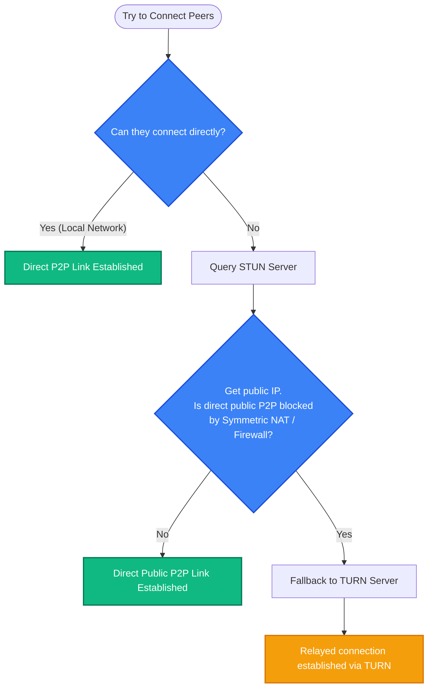
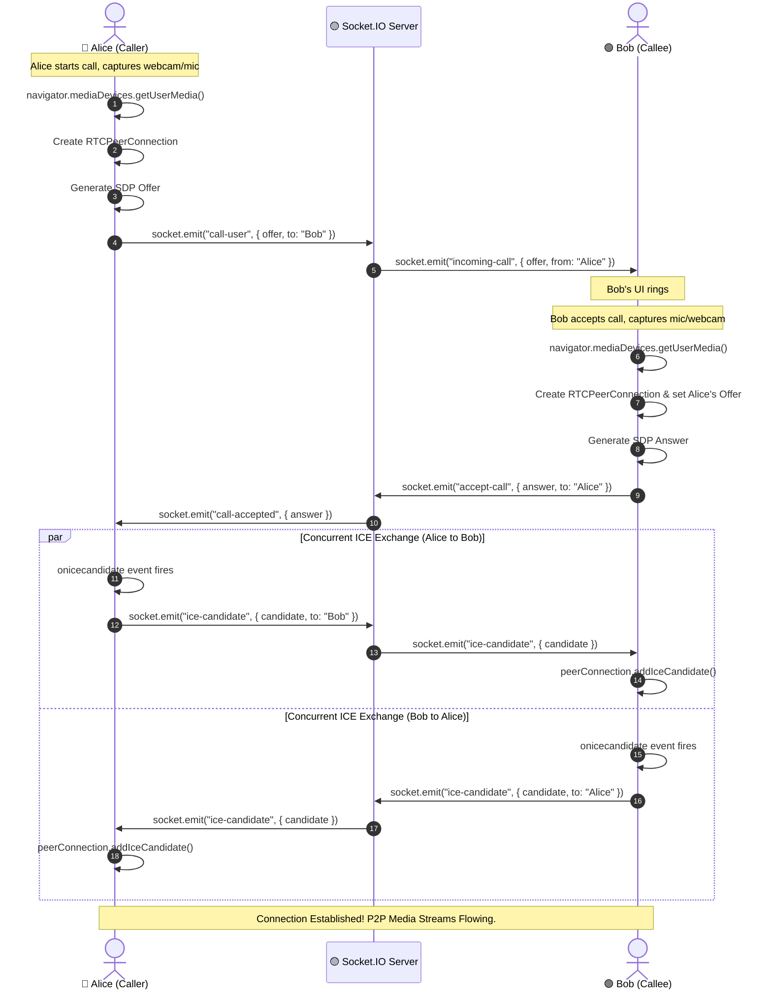

# Phase 7: Voice & Video Calls (Technical Summary)

This document contains a summary of everything learned, planned, and discussed during Phase 7 regarding Voice & Video Calls architecture.

---

## 🎙️ Core Concepts & Analogies

### 1. WebRTC (Web Real-Time Communication)
WebRTC is an open-source standard that allows browsers to stream audio, video, and raw data directly **Peer-to-Peer (P2P)** without routing the media through a central server. This delivers high-quality streams with extremely low latency.

* **RTCPeerConnection:** The main browser API that manages the connection lifecycle, audio/video encoding/decoding, packet loss recovery, and encryption.

---

### 2. SDP (Session Description Protocol)
> **Analogy: The "Media Capabilities & Agreement Form"**

Before two browsers can stream video or audio to each other, they must agree on how to format, compress, and encrypt the data. They cannot simply throw raw bytes across the internet. 

The **SDP Offer** is a plain-text block containing:
* **Media Types:** *"I want to send 1 audio stream and 1 video stream."*
* **Supported Formats (Codecs):** *"I know how to encode/decode video using VP8, VP9, or H.264, and audio using Opus."*
* **Security Parameters:** *"Here are the temporary encryption keys we will use to secure our connection."*

**The SDP Exchange Process:**
1. **User A (Caller)** generates an **SDP Offer** outlining their capabilities.
2. **User B (Callee)** receives User A's Offer, reviews it, and returns an **SDP Answer** confirming the formats they both support: *"Okay, we both support VP8 and Opus, let's use those formats, and let's use these encryption keys."*

---

### 3. ICE Candidates (Interactive Connectivity Establishment)
> **Analogy: "Mailing Address Options"**

Even after agreeing on *how* to encode/encrypt the media (SDP exchange), the browsers still do not know **how to physically route packets to each other over the internet**. 

#### The Problem: Private IPs & Router Firewalls
Your computer is usually behind a home router or corporate firewall. It only knows its local IP address (e.g., `192.168.1.15`). 
* If User A tried to send video data directly to User B's local IP, the packets would fail, because millions of devices share that same local IP.
* Furthermore, router firewalls block unsolicited incoming connections from the outside world by default.

#### The Solution: Gathers Address Options (Candidates)
An **ICE Candidate** represents a potential IP address, port, and protocol (UDP/TCP) that a browser thinks other computers can use to reach it. The browser gathers three types of candidates:

1. **Host Candidate (Local Network):** 
   * *"Try reaching me at local IP `192.168.1.15` on port `54321`."*
   * *Usage:* Only works if both users are on the same home WiFi network.
2. **Server Reflexive Candidate (STUN Public IP):** 
   * The browser contacts a public **STUN server** to ask: *"What is my public IP address?"* The STUN server replies: *"Your public IP is `203.0.113.5` on port `61200`."*
   * The browser creates a candidate: *"Try reaching me at public IP `203.0.113.5` on port `61200`."*
3. **Relay Candidate (TURN Server):** 
   * If a direct P2P link is blocked by a strict firewall (like symmetric NAT), the browser uses a **TURN server** (a public relay server): *"If all else fails, send your video to the TURN server at `198.51.100.1:3478` and it will forward it to me."*

#### The ICE Candidate Exchange
While the call is initializing, both browsers concurrently gather these options. As soon as a browser discovers a new candidate, it immediately sends it to the other user via Socket.IO.

Once both browsers have each other's lists, WebRTC starts testing them in order of speed:
1. **Local WiFi** (Host Candidates)
2. **Direct Public IP** (Server Reflexive Candidates)
3. **Relay Server** (Relay Candidates - fallback)

As soon as a connection test succeeds, the WebRTC connection switches to **"Connected"**, signaling stops, and the video/audio streams start playing!

---

### 4. STUN vs. TURN & NAT Traversal Flow



---

## 🗺️ Architecture & Signaling Flow

WebRTC handles P2P media streaming, but browsers need a way to find each other. This discovery channel is called **Signaling**, and it is handled over our existing **Socket.IO** real-time server.

The sequence diagram below details the entire negotiation lifecycle:



---

## 🛠️ Code Implementation: `RTC_CONFIG` & `RTCPeerConnection`

On the client-side, we configure WebRTC by passing an `RTC_CONFIG` object into the constructor of `RTCPeerConnection`.

### The Configuration Object
```javascript
const RTC_CONFIG = {
  iceServers: [
    { urls: 'stun:stun.l.google.com:19302' },
    { urls: 'stun:stun1.l.google.com:19302' },
    { urls: 'stun:stun2.l.google.com:19302' }
  ]
}
```
* **`iceServers`:** Lists the servers the browser should contact to resolve its network location.
* **`stun:` Protocol:** Denotes a STUN (Session Traversal Utilities for NAT) server. A STUN server does not relay media; it simply reflects the client's public IP and port back to them.
* **Google's Public Servers:** `stun.l.google.com:19302`, `stun1`, and `stun2` are free, highly-available public STUN servers hosted by Google. We define multiple URLs for redundancy (failover).

### How the Browser Uses It Under-The-Hood
1. **Instantiation:** When we run `const pc = new RTCPeerConnection(RTC_CONFIG)`, the browser starts a background process and reads the `iceServers`.
2. **Ping STUN:** The browser pings `stun.l.google.com:19302` in the background: *"What is my public IP address and port?"*
3. **Response:** The STUN server reflects back: *"I see your packets coming from public IP `203.0.113.5` on port `61200`."*
4. **Acquiring Candidates:** The browser wraps this response into an **ICE Candidate** representing this public network path.
5. **Callback Event (`onicecandidate`):** The browser fires our local event handler:
   ```javascript
   pc.onicecandidate = (event) => {
     if (event.candidate) {
       // Send the candidate over Socket.IO to the peer
       socket.emit('ice-candidate', {
         to: targetUserId,
         candidate: event.candidate
       });
     }
   };
   ```
6. **Negotiating Connection:** Both browsers test the received candidates in order of speed. Once a path succeeds, they bind and stream media directly.

---

## 🙋 Common Questions & Technical Doubts

### Q1: Is the audio/video stream routed through the Node.js server?
**Answer:** **No.** 
Once the SDP parameters and ICE candidates are exchanged via the Node.js/Socket.IO signaling server, the media streams flow directly between the browsers. The server only handles the signaling messages, keeping CPU and bandwidth usage very low. The only exception is when a TURN server is needed, but the TURN server is run as a separate specialized service, not inside the Node.js backend app.

### Q2: What happens if a user turns off their camera or microphone mid-call?
**Answer:** WebRTC streams can be updated dynamically. 
The track is either disabled locally (`track.enabled = false`), which stops capturing data but keeps the connection alive (resulting in a black screen or mute), or renegotiation is triggered by adding/removing tracks, which sends a new SDP Offer/Answer to update the stream properties.

### Q3: How do we support multiple callers (group calls)?
**Answer:** There are three architectures for multi-user calls:
1. **Mesh (Peer-to-Peer):** Every user establishes a P2P connection to every other user. Simple to set up but highly CPU and upload bandwidth intensive (e.g., 4 users require 3 uploads and 3 downloads per client). Ideal only for very small groups (3-4 users max).
2. **SFU (Selective Forwarding Unit):** Everyone sends their single stream to a central server, which forwards it to the other participants. Significantly reduces upload bandwidth.
3. **MCU (Multipoint Control Unit):** A central server mixes all streams into a single composite stream. Highly CPU-intensive for the server but very lightweight for clients.

*For this boilerplate, we are focusing on a **Mesh** or **1-to-1** architecture for simplicity and zero-cost hosting.*
