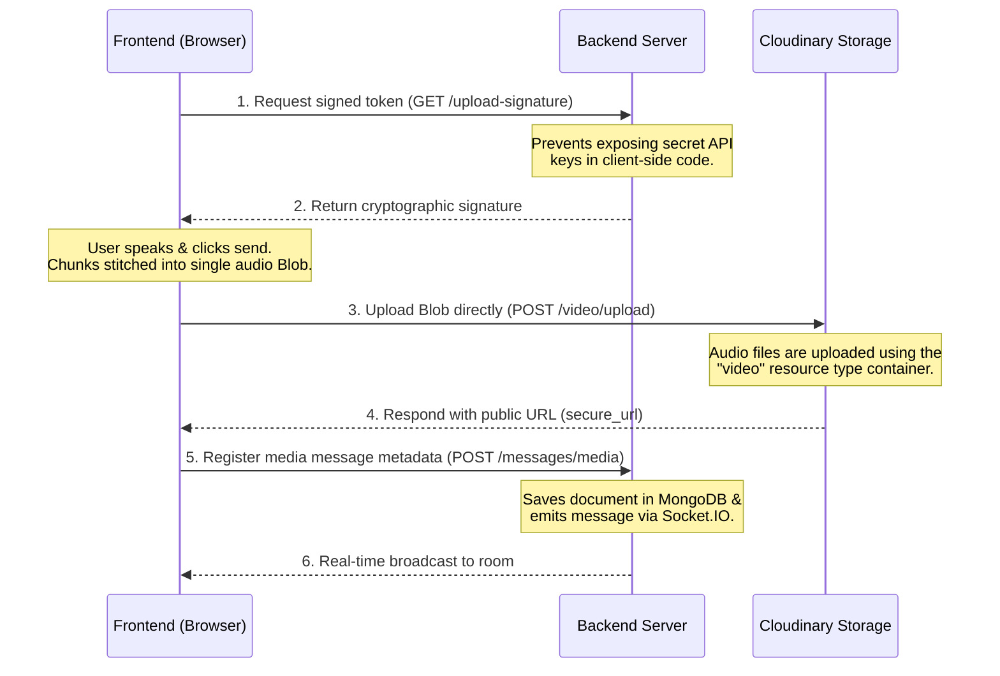

# Phase 6: Voice Notes (Technical Summary)

This document contains a summary of everything learned, implemented, and discussed during Phase 6 regarding Voice Notes architecture.

---

## 🎙️ Core Concepts

### 1. Browser MediaRecorder API
The browser's native API used to capture audio streams directly from user input devices.
- **Microphone Access:** Requested via `navigator.mediaDevices.getUserMedia({ audio: true })`.
- **Event Listeners:** 
  - `ondataavailable`: Fires periodically to deliver audio chunks.
  - `onstop`: Fires when the recording stops, where chunks are processed.

### 2. Blobs & Chunk Handling
- **Blob (Binary Large Object):** A representation of raw file data stored in memory (RAM).
- **Process:** Audio data is captured in small, consecutive array fragments (`chunks`). Upon ending the recording, these chunks are combined into a single, unified container:
  ```javascript
  const audioBlob = new Blob(chunks, { type: 'audio/webm' })
  ```
- **Serialization:** To transmit this in-memory file over the network, it is wrapped inside a standard `FormData` object.

### 3. Waveform Visualization (WaveSurfer.js)
Displays interactive audio waveforms rather than using browser-default HTML `<audio>` elements.
- **Dynamic Styling:** Fetches the active CSS custom property `--accent-color` at runtime so the waveform's progress line matches the user's selected UI theme (Sunset, Forest, Dracula, etc.).
- **Playback Controls:** Handles canvas rendering, timeline tracking, and playback speed rate multipliers (`1x`, `1.5x`, `2x`).

---

## 🗺️ Architecture & Data Flow

Below is the step-by-step sequence detailing how voice notes are requested, uploaded, and saved:



---

## 🙋 Common Questions & Technical Doubts

### Q1: Is the audio sent in chunks or all at once?
**Answer:** It is sent **all at once**.
While recording, the browser captures the stream in small fragments to save memory. However, once recording stops, these chunks are consolidated into a single `Blob` (file) in memory and uploaded to the server as a single complete payload.

### Q2: Does the audio travel via the backend server or directly to Cloudinary?
**Answer:** It goes **directly to Cloudinary**.
To minimize server load and bandwidth costs, the frontend uploads the binary payload directly to Cloudinary's API endpoints using a signature retrieved from the server. The server is only notified once the upload is completed, receiving a text metadata reference containing the asset's URL.

### Q3: Why is the Cloudinary resource type set to `video` for audio files?
**Answer:** Cloudinary treats all audio files (like `.webm`, `.mp3`, `.wav`) under the `video` resource category. Direct uploads to Cloudinary for voice notes must route to:
`https://api.cloudinary.com/v1_1/<cloud_name>/video/upload`

---

## 📂 File Modifications

The following files were created/modified during Phase 6:

1. **[AudioPlayer.jsx](file:///c:/Users/mrsan/Desktop/Boilerplate/frontend/src/components/AudioPlayer.jsx) [NEW]**
   - Renders visual waveforms, audio timers, and speed selector buttons using `wavesurfer.js`.
2. **[chatController.js](file:///c:/Users/mrsan/Desktop/Boilerplate/backend/controllers/chatController.js) [MODIFY]**
   - Added `'audio'` type approval inside `createMediaMessage` logic.
3. **[chatService.js](file:///c:/Users/mrsan/Desktop/Boilerplate/frontend/src/services/chatService.js) [MODIFY]**
   - Configured `uploadDirectToCloudinary` to direct audio files to the `video` endpoint.
4. **[ChatPage.jsx](file:///c:/Users/mrsan/Desktop/Boilerplate/frontend/src/pages/ChatPage.jsx) [MODIFY]**
   - Added recording hooks, timer increments, microphone icons, preview cancel buttons, and simulated mock audio URLs.
