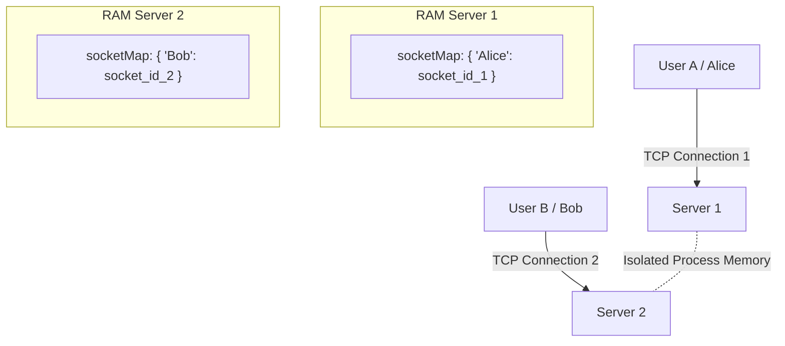
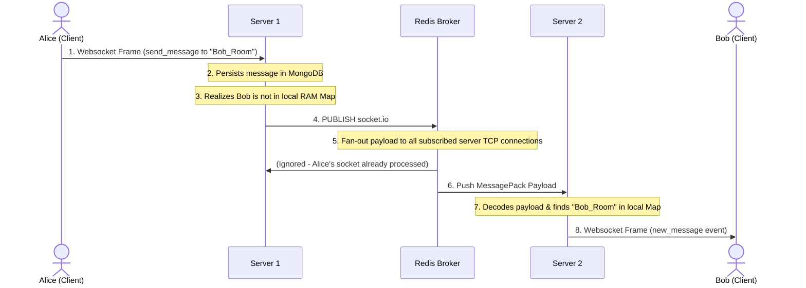

# 🔌 Socket.IO Broadcasting & Horizontal Scaling

This document details the mechanics of Socket.IO broadcasting, the challenges encountered when scaling horizontally across multiple server instances, and the step-by-step Redis Pub/Sub solution.

---

## 1. Socket.IO Broadcasting Scopes

Broadcasting allows a socket connection to send events to multiple recipients simultaneously. Socket.IO supports three primary emission targets:

*   **`socket.emit(...)`**: Emits an event back to the single connection that initiated the query (unicast).
*   **`socket.broadcast.emit(...)`**: Emits an event to **every other** connected socket on the server *except* the sender.
*   **`socket.to(room).emit(...)`**: Emits an event to **every other** socket in a logical room *except* the sender.
*   **`io.to(room).emit(...)`**: Emits an event to **all** sockets in a logical room *including* the sender.

---

## 2. The Scaling Issue: Process Isolation

When scaling an application horizontally to handle higher concurrent traffic, you run multiple server instances behind a load balancer. However, raw WebSockets fail to route messages correctly in this configuration.

### The Problem Architecture



### Why it breaks:
1.  **Process Isolation**: Each server instance is an isolated OS process running its own V8 engine heap. Server 1 cannot read the socket Map stored in Server 2's RAM.
2.  **TCP Connection Binding**: A TCP connection is represented by a physical operating system socket file descriptor bound to a specific process. It cannot be shared or transferred over the network directly.
3.  **Silent Failure**: When Alice sends a message to Bob, the request lands on **Server 1**. Server 1 queries its local memory map for Bob's connection, fails to find it, and silently discards the event. Bob (on Server 2) never receives it.

---

## 3. The Solution: Redis Pub/Sub Adapter

To coordinate real-time broadcasts across distinct instances, we replace the default in-memory adapter with the **Redis Adapter** (`@socket.io/redis-adapter`).

Redis acts as a shared, sub-millisecond, in-memory message broker running on a centralized server.

### Redis Memory Model (What is a Channel?)
Inside Redis's RAM, a Pub/Sub channel is simply an entry in a hash table mapping the channel name to the TCP sockets of the listening servers:

```javascript
// Redis internal representation in RAM
pubsub_channels = {
  "socket.io#/#": [ Server_1_Subscription_TCP_Socket, Server_2_Subscription_TCP_Socket ]
}
```

When a message is published, Redis loops through the list of active TCP sockets for that channel and writes the serialized payload down each connection.

---

## 4. Detailed Data Flow Lifecycle

Here is the exact data path when Alice sends a message to Bob in a multi-server setup:



---

## 5. Low-Level Commands & Code Snippets

### A. Redis RESP Commands Exchanged
Under the hood, the servers communicate with Redis using the **RESP (REdis Serialization Protocol)** over TCP:

1.  **Subscription (On Server Start)**:
    Server 2 opens a dedicated TCP subscription socket to Redis and transmits:
    ```text
    SUBSCRIBE socket.io#/#
    ```
2.  **Publication (On Message Emit)**:
    When Server 1 triggers a broadcast, it writes the publish command:
    ```text
    PUBLISH socket.io#/# "{\"room\":\"Bob_Room\",\"event\":\"new_message\",\"payload\":\"Hi\"}"
    ```
3.  **Redis Broadcast Forwarding**:
    Redis fans out the packet to Server 2's TCP connection:
    ```text
    message
    socket.io#/#
    {"room":"Bob_Room","event":"new_message","payload":"Hi"}
    ```

---

### B. Node.js Reference Implementation (Conceptual)

The code snippet below demonstrates how the Node.js event loop handles publishing and listening using a Redis client:

```javascript
import Redis from 'ioredis'

// 1. Establish separate TCP connections to Redis
const pubClient = new Redis({ host: 'localhost', port: 6379 })
const subClient = new Redis({ host: 'localhost', port: 6379 })

// 2. Subscribe to the shared namespace channel
subClient.subscribe('socket.io#/#')

// 3. Receive message broadcasts from Redis
subClient.on('message', (channel, messageString) => {
  const { room, event, payload } = JSON.parse(messageString)

  // Fetch local sockets belonging to this room from local memory Map
  const localSocketsInRoom = io.sockets.adapter.rooms.get(room)
  
  if (localSocketsInRoom) {
    localSocketsInRoom.forEach((socketId) => {
      const socket = io.sockets.sockets.get(socketId)
      if (socket) {
        // Write WebSocket frame to Client Browser TCP connection
        socket.emit(event, payload)
      }
    })
  }
})

// 4. Send client events to the Redis channel
io.on('connection', (socket) => {
  socket.on('send_message', (data) => {
    const broadcastPacket = {
      room: data.receiverId,
      event: 'new_message',
      payload: data
    }
    
    // Broadcast message via Redis Pub/Sub
    pubClient.publish('socket.io#/#', JSON.stringify(broadcastPacket))
  })
})
```
