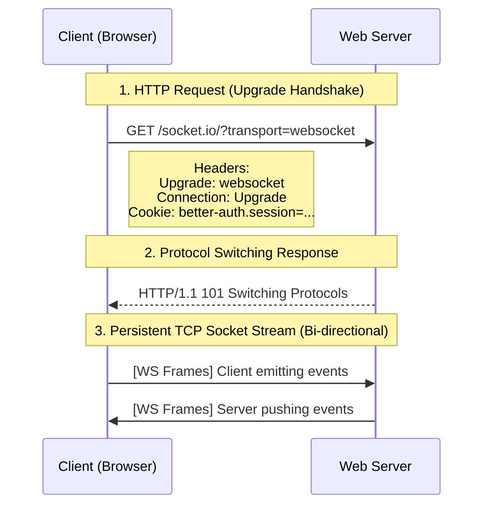
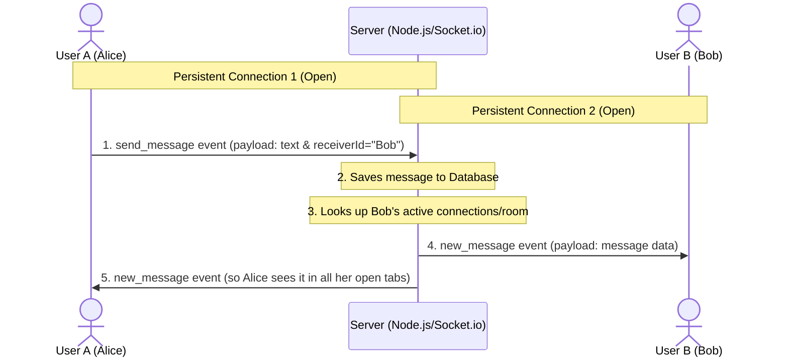

# 🔌 WebSockets & Socket.IO Basics — Revision Notes (Phase 1)

This document serves as a conceptual revision reference for real-time bi-directional messaging, session authentication, and user presence tracking.

---

## 1. HTTP vs. WebSockets (The Upgrade Handshake)

In standard web applications, HTTP uses a stateless **Request-Response** pattern. To receive fresh data, the client must pull it. WebSockets introduce a persistent connection.



### Key Differences
| Feature | HTTP | WebSockets |
| :--- | :--- | :--- |
| **Connection** | Opens and closes on each request (stateless) | Persistent, long-lived (stateful) |
| **Direction** | Unidirectional (Client $\rightarrow$ Server) | Bi-directional (Client $\leftrightarrow$ Server) |
| **Overhead** | High (Includes full request/response headers) | Very low (Tiny frame header wrapping text/binary) |

---

## 2. Socket.IO Core Abstractions

Socket.IO sits on top of raw WebSockets, introducing three critical organizational abstractions:

```
[Socket.IO Server]
  ├── Default Namespace ('/')
  │     ├── Room: 'user_abc123'  --> Socket (Tab 1), Socket (Tab 2)
  │     └── Room: 'user_xyz789'  --> Socket (Tab 1)
  └── Admin Namespace ('/admin')
```

1. **Sockets**: Represent an individual connection from a browser tab to the server. Each socket receives a unique random ID (e.g., `socket.id = "s-7XyZ..."`).
2. **Rooms**: Virtual channels that sockets can `join` or `leave`. An event emitted to a room (`io.to(roomId).emit(...)`) is multiplexed to all sockets currently registered in that room. Sockets automatically join a room equal to their `userId` to simplify targeted messaging.
3. **Namespaces**: Separate communication paths sharing the same underlying connection (e.g., `/` for general chat, `/admin` for dashboard logs).

### 2.1 Sockets (Connections) vs. Private Rooms

It is critical to distinguish between a physical network connection and a logical room:

*   **Socket / Connection (Physical)**: A unique network socket stream opened per browser tab (e.g., Tab 1 = `socket.id_1`, Tab 2 = `socket.id_2`).
*   **Private User Room (Logical)**: A server-side room named after the user's database `userId`. Every connection from the same user joins this room (`socket.join(userId)`).

```
[User Bob]
   ├── Tab 1 Connection (socket.id: "abc...") ──(joins)──┐
   ├── Tab 2 Connection (socket.id: "qwe...") ──(joins)──┼───► [Room: "bob_user_id"]
   └── Tab 3 Connection (socket.id: "xyz...") ──(joins)──┘
```

> [!NOTE]
> **Core Concept**: When sending a message to a user, the server targets their logical room (`io.to(userId)`). Socket.IO automatically pushes the event down all active connections joined to that room.

---

## 3. Session Sharing & Socket Authentication

Because WebSockets start with an HTTP request, the browser automatically attaches cookies to the handshake connection request. We leverage this to authenticate the connection.

### How Handshake Authentication Works
We intercept the initial connection with a **Socket.IO Middleware** and validate the session cookie against our database via **Better Auth**:

```javascript
// Middleware code snippet from backend
io.use(async (socket, next) => {
  try {
    // 1. Pass the handshake headers (which contain the Cookie) directly to Better Auth
    const session = await auth.api.getSession({
      headers: socket.handshake.headers
    })

    if (!session || !session.user) {
      return next(new Error('Unauthorized: Session not found'))
    }

    // 2. Attach authenticated user details to the socket instance for future event handlers
    socket.userId = session.user.id
    socket.username = session.user.username
    next()
  } catch (err) {
    next(new Error('Unauthorized: Verification failed'))
  }
})
```

---

## 4. Heartbeats & Presence Tracking

WebSockets rely on persistent connections, but clients can disappear abruptly (network drops, dead battery, closed laptops) without closing the connection cleanly. Heartbeats are helpful for detecting these events and updating the user's "last seen" timestamp in the database.

### Heartbeat (Ping/Pong) Flow
To detect silent disconnections, Socket.IO runs a background heartbeat loop:
```
Server  ───────── (ping frame) ─────────> Client
Server  <──────── (pong frame) ───────── Client (Kept Alive)

Server  ───────── (ping frame) ─────────> Client (Client has offline signal)
Server  ..waits for pingTimeout (e.g. 20s).. 
Server  ───────── Disconnect Event ───────> (Cleans up connections)
```

### Multi-Tab Connection Tracking
A single user can open multiple tabs (multiple sockets). If we set status to "offline" when one tab closes, we create a bug.
To prevent this, we track connections using a `Map` of sets:

```javascript
// Active connection map on the backend
const activeConnections = new Map() // Map<userId, Set<socketId>>

// When a new socket connects
function handleConnect(userId, socketId) {
  if (!activeConnections.has(userId)) {
    activeConnections.set(userId, new Set())
  }
  activeConnections.get(userId).add(socketId)
  
  if (activeConnections.get(userId).size === 1) {
    // First connection: transition user status to ONLINE
    io.emit('user_online', { userId })
  }
}

// When a socket disconnects
function handleDisconnect(userId, socketId) {
  const userSockets = activeConnections.get(userId)
  if (userSockets) {
    userSockets.delete(socketId)
    
    if (userSockets.size === 0) {
      activeConnections.delete(userId)
      // Final connection closed: transition user status to OFFLINE
      io.emit('user_offline', { userId, lastSeen: new Date() })
    }
  }
}
```

---

## 5. Message Routing Flow & Offline Handling

Since WebSocket connections are client-to-server (and not peer-to-peer), the server acts as an event broker. It intercepts messages, saves them to the database, and routes them to the correct recipient's active socket room.



### What happens if the recipient is offline?

If **User B (Bob)** is offline when **User A (Alice)** sends a message:

1. **Database Persistence**: The server successfully executes `Message.create()` to store the message in MongoDB.
2. **Silent Emit Failure**: The server attempts to broadcast the message to Bob's room:
   ```javascript
   io.to(userId).to(receiverId).emit('new_message', message)
   ```
   Since Bob is offline, no sockets are joined to the `receiverId` room, and Socket.io drops the event silently.
3. **Re-synchronization**: When Bob reconnects later, his client calls `fetchMessages()` (HTTP API) to pull the chat history, retrieving the message Alice sent while he was offline.

---

## 6. Message Status Ticks (Sent, Delivered, Read)

To support WhatsApp-style status tracking, we replaced the simple `isRead` boolean with a strict database `status` **enum** and live socket broadcasts:

### 6.1 Database Schema Definition
Messages are stored in MongoDB with one of three predefined enum values:
```javascript
status: {
  type: String,
  enum: ['sent', 'delivered', 'read'],
  default: 'sent',
}
```

### 6.2 The Status Update Flow
```
[User A (Sender)]             [Server & DB]              [User B (Receiver)]
      │                             │                             │
      │ ─── 1. send_message ──────► │                             │
      │                             │ ── (Is Receiver online?)    │
      │                             │                             │
      │ ◄── 2. single tick (sent) ─ │ (Offline)                   │
      │                             │                             │
      │ ◄── 2. double tick ──────── │ (Online: status="delivered") │
      │      (delivered)            │ ──── 3. new_message ──────► │
      │                             │                             │
      │                             │ ◄─── 4. mark_as_read ────── │ (Bob opens chat)
      │ ◄── 5. blue tick (read) ─── │ (Status updates to "read")  │
```

### 6.3 Event Synchronizers
1. **`messages_delivered`**: Emitted when Bob connects to the WebSocket. The server updates all his pending `'sent'` messages to `'delivered'` and alerts Alice's client to show grey double ticks.
2. **`messages_read`**: Emitted when Bob selects Alice's chat or receives a new message while looking at her chat. The server updates the database status to `'read'` and alerts Alice's client to show blue double ticks.

